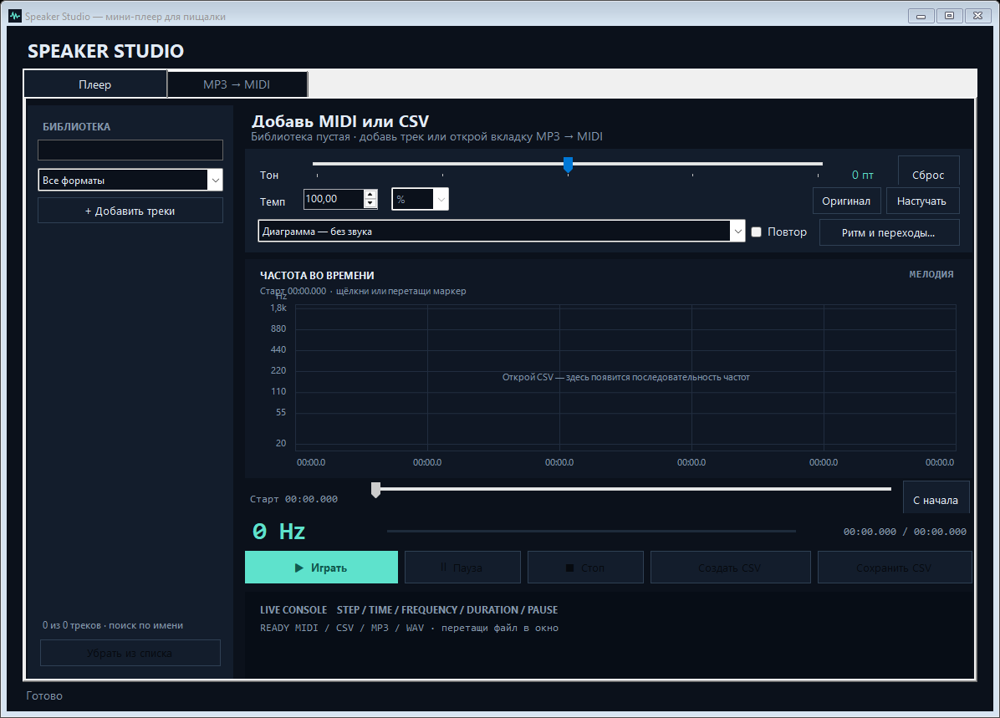
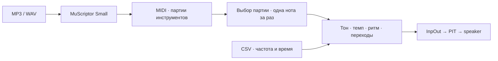

# Speaker Studio

Маленькая пищалка материнской платы обычно сообщает об ошибках при загрузке.
Мне захотелось проиграть через неё мелодию из Windows. Первая попытка с
`Beep` закончилась писком из колонок монитора; до speaker пришлось добираться
через InpOut и аппаратный таймер PIT.

Когда тон наконец появился, возникла задача интереснее: как уместить музыку
в устройстве, которое в каждый момент играет одну частоту? Из этого вырос
Speaker Studio — Windows приложение для превращения MP3 и MIDI в мелодию
для физического PC speaker.



## Скачать и запустить

**[Скачать приложение с MuScriptor Small — ZIP, 388 МБ](https://github.com/esinkirill/speaker-studio/releases/download/v2.0.2/SpeakerStudio-2.0.2-win-x64-with-model.zip)**  
[Страница релиза](https://github.com/esinkirill/speaker-studio/releases/tag/v2.0.2)

Нужна **Windows 10 22H2 или Windows 11, x64**. Модель, Python, PyTorch CPU,
Node и InpOut уже входят в комплект.

1. Распаковать ZIP целиком в папку, где приложение сможет сохранять результаты.
2. При отсутствии Visual C++ x64 runtime установить
   [официальный пакет Microsoft](https://aka.ms/vc14/vc_redist.x64.exe).
3. Один раз запустить **`Prepare-Audio.cmd`** с интернетом. Скрипт получает
   FFmpeg от BtbN и Essentia.js из npm и размещает их в папке приложения.
4. Открыть **`SpeakerStudio.exe`**. Дальше аудио обрабатывается локально на CPU.

Для физического звука нужна пищалка на разъёме **Speaker/Buzzer**, подключённая
по руководству своей платы. Этот выход требует прав administrator: InpOut
обращается к портам через kernel driver. Сначала мелодию можно послушать через
выход **«Колонки — предпросмотр»**.

В версии 2.0.2 исправлено исключение при выборе партии MIDI. Для обновления
уже распакованной версии достаточно закрыть приложение и заменить EXE из
маленького `SpeakerStudio-2.0.2-hotfix.zip` на странице релиза.

## Как получается мелодия



На вкладке MP3 → MIDI добавляется запись и запускается конвертация. Готовый
MIDI появляется в библиотеке; из него выбирается ведущая партия и создаётся
CSV. Если подходящий MIDI уже есть, можно сразу начать с него.

Полный MIDI сохраняет аккорды и инструменты. Для speaker берётся верхняя
активная нота выбранной партии, ударные пропускаются. Поэтому выбор партии
существенно влияет на результат: бас, аккорды и высокая гармоника могут
заслонить ту мелодию, которую хочется услышать.

Тон, темп и артикуляцию удобнее подбирать на коротком участке трека.
[Руководство по звучанию](docs/USER_GUIDE.md) объясняет, как опустить мелодию
на октаву, добавить короткие промежутки и сохранить настройки в CSV.

## MP3 → MIDI

Встроена **[MuScriptor Small](https://huggingface.co/MuScriptor/muscriptor-small)**
от **Kyutai × Mirelo**: около 103 млн параметров, 412 МБ весов. FFmpeg приводит
запись к mono 16 kHz, модель обрабатывает её кусками по 5 секунд и возвращает
ноты с группами инструментов. Оценку BPM отдельно выполняет Essentia.

Конвертация на CPU может занимать больше времени, чем сама запись. Для плотной
аранжировки полезно сначала получить MIDI и выбрать подходящий инструмент,
а затем заниматься его сведением к одной линии.

[Описание интеграции модели](docs/MODEL.md) содержит схему файлов, вызов
Python из C# и инструкции для подключения конвертера к собственной сборке.

## Почему это оказалось интереснее обычного Beep

**Гармоника может притвориться мелодией.** В одном из разборов группы нот
расходились примерно на 19 полутонов — почти отношение частот 3:1.
Спектральный максимум в таком случае способен выбрать третью гармонику.
Для поиска подходящей линии были сравнены 144 варианта транскрипции и
монофонического сведения.

**BPM не спрятан в количестве строк CSV.** Одна длинная нота может занимать
строку, а плавный переход — десятки строк. Музыкальная сетка рассчитывается
как `60000 / BPM / частей на четверть`; она помогает выровнять события.
Изменение темпа масштабирует время всей мелодии.

**Даже тишину нужно откуда-то взять.** Добавление паузы после каждой ноты
удлиняет трек. «Разделение» переносит часть времени звучания в тишину, сохраняя
общую длину. Плавный переход, напротив, меняет частоту между соседними нотами
по логарифмической кривой, оставляя настоящие паузы на месте.

[В исследовании](docs/RESEARCH.md) разобраны PIT, выбор голоса, результаты
сравнения конвертеров и музыкальное время. Там же объясняется, почему обычный
тон не передаёт тембр записи и почему доля звучания не регулирует напряжение
на speaker.

## Работа с исходниками

GUI написан на C# / WinForms и собирается компилятором .NET Framework 4,
без NuGet и Visual Studio:

```powershell
git clone https://github.com/esinkirill/speaker-studio.git
cd speaker-studio
.\speaker-player\build.ps1
.\speaker-player\SpeakerStudio.exe
```

Для всех функций нужно скопировать из готового комплекта `runtime/`,
`models/`, `licenses/` и InpOut DLL в `speaker-player/`, затем выполнить
`Prepare-Audio.cmd`. Подробности размещения — в
[инструкции по подключению модели](docs/MODEL.md#подключение-к-сборке-из-git).

Устройство кода описано в [архитектуре приложения](docs/ARCHITECTURE.md),
формат треков — в [справочнике CSV](docs/CSV_FORMAT.md).
[Тесты](speaker-player/tests/README.md) охватывают время, преобразования,
перемотку и экспорт на искусственных MIDI/CSV.

Код приложения — [MIT](LICENSE). Веса MuScriptor Small — CC BY-NC 4.0.
Источники компонентов и их версии собраны в
[списке зависимостей](docs/DEPENDENCIES.md).

