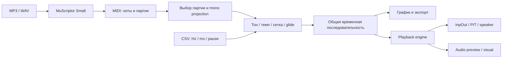

# Speaker Studio

**Музыкальная студия для физической пищалки материнской платы — и исследование того, что из неё можно получить в современной Windows.**

Проект вырос из простого вопроса: как заставить именно PC speaker в корпусе
воспроизводить звук по команде, если обычный `Console.Beep()` звучит через
аудиоустройство? Получилось Windows приложение с библиотекой MIDI/CSV,
перемоткой, настройкой тона и ритма, плавными переходами частоты и отдельной
вкладкой локального MP3 → MIDI.

Цель исследования — сохранить узнаваемую мелодию на устройстве, которое в
используемом режиме воспроизводит одну частоту в каждый момент времени.
Точное восстановление исходной записи и тембра этим способом не достигается.


## Что умеет приложение

- Библиотека с поиском, фильтрами MIDI/CSV/MP3 и удалением записей из списка.
- MIDI → монофоническая последовательность → CSV из трёх отдельных столбцов.
- Piano roll для MIDI и график частоты для CSV; частоты и длительности в live console.
- Старт с выбранного места, перемотка, пауза, повтор.
- Транспонирование в полутонах, изменение темпа в BPM или процентах.
- Музыкальная сетка, триоли, quantization, чередование звука и тишины.
- Плавные переходы высоты между соседними нотами по логарифмической кривой.
- Локальное распознавание MP3/WAV в MIDI с MuScriptor Small; отдельная оценка BPM.
- Выходы: физический speaker, звуковой предпросмотр и визуальный режим без звука.

## Быстрый запуск из исходников

Целевая система: **Windows 10/11 x64**. Основное приложение написано на C# / WinForms
и собирается штатным компилятором .NET Framework 4; Visual Studio для этой сборки
не требуется. На отдельной чистой Windows VM релиз пока не проверялся.

В PowerShell из корня клонированного репозитория:

```powershell
.\speaker-player\build.ps1
.\speaker-player\SpeakerStudio.exe
```

В приложении добавьте [examples/demo.csv](examples/demo.csv), выберите
**«Диаграмма — без звука»** и нажмите **«Играть»**. Этого достаточно, чтобы
проверить библиотеку, график, темп, переходы, перемотку и экспорт CSV.

В репозитории опубликованы исходники и искусственные примеры.
DLL InpOut, Python/Node runtime, FFmpeg, Essentia и веса модели подключаются
отдельно; без них недоступны соответствующие аппаратные и MP3-функции.
Точные версии, размещение файлов и условия использования описаны в
[DEPENDENCIES.md](docs/DEPENDENCIES.md).

### Физический speaker

Нужна пищалка, подключённая к **Speaker/Buzzer-разъёму согласно руководству
конкретной платы**. Контакты Power LED и переднего аудио для этого не подходят.
В режиме speaker приложение обращается к InpOut DLL; она использует kernel driver,
поэтому потребуется запуск с правами administrator. Возможность работы зависит
от платы, аппаратного пути и политики загрузки драйверов Windows.

После добавления официальной InpOut DLL рядом с EXE выберите физический выход.
При UAC приложение открывается с повышенными правами; воспроизведение запускается
повторным нажатием **«Играть»**. Совместимость со всеми конфигурациями не заявляется.
Описание портов и экспериментального подтверждения есть в
[исследовании](docs/RESEARCH.md).

## Как устроен путь мелодии



Оригинальный MIDI сохраняет партии и многоголосие. Для пищалки из активных нот
выбранной партии берётся верхняя нота, ударные пропускаются. Это простое
воспроизводимое правило, которое можно улучшать; оно не гарантирует правильное
выделение ведущей мелодии в любой аранжировке.

## BPM, сетка и плавные переходы

Эти параметры решают разные задачи:

| Параметр | Что меняет |
| --- | --- |
| Тон | Частоту: `f' = f × 2^(полутоны / 12)` |
| Темп | Масштаб времени: `speed = targetBPM / sourceBPM` |
| Сетка | Ритмические границы: `шаг_мс = 60000 / targetBPM / частей_четверти` |
| Звук, % | Долю времени звучания внутри клетки; это не напряжение и не громкость |
| Переход, мс | Время плавного изменения частоты между соседними нотами |
| Шаг кривой, мс | Интервал обновления частоты: 5 / 10 / 20 / 50 мс |

При 120 BPM и четырёх частях четверти шаг сетки равен 125 мс.
Сетка помогает организовать ритм, но сама по себе не определяет BPM и не повышает
точность распознавания нот. Плавность частоты также не восстанавливает тембр MP3.
Подробные формулы, порядок преобразований и ограничения — в
[RESEARCH.md](docs/RESEARCH.md).

## Документация

| Документ | Что внутри |
| --- | --- |
| [Руководство](docs/USER_GUIDE.md) | Библиотека, MIDI → CSV, темп, эффекты, перемотка, MP3 |
| [Исследование](docs/RESEARCH.md) | Железо, Windows Beep, формулы, гипотезы, эксперименты и выводы |
| [Архитектура](docs/ARCHITECTURE.md) | Ответственность модулей, playback clock, seek и процессы конвертера |
| [Формат CSV](docs/CSV_FORMAT.md) | Три столбца, паузы, metadata и редактирование в Excel |
| [Зависимости](docs/DEPENDENCIES.md) | Версии, лицензии, источники и подготовка локального runtime |
| [Проверки](docs/VERIFICATION.md) | Что можно повторить из clone; что проверено только в локальном комплекте |
| [Вклад в проект](CONTRIBUTING.md) | Как проверить изменения и предложить новый эксперимент |

## Проверка исходников

```powershell
.\speaker-player\test.ps1
```

Проверки используют искусственные данные и визуальный режим.
Они не требуют личной музыки, не загружают InpOut и не включают звук.
Сборка, успешное чтение регистра и тесты тайминга **не доказывают физического
звучания**. Аппаратный эксперимент и оценка узнаваемости мелодии остаются отдельной
ручной проверкой. Текущие результаты приведены в
[VERIFICATION.md](docs/VERIFICATION.md).

## Статус и ограничения

- Приложение 2.0: исходники UI, парсера, timing engine и конвертеров опубликованы.
- Локальный CPU MP3 → MIDI проверен на небольших записях; точность ведущей
  мелодии без ручной разметки не измерена.
- Speaker играет монофоническую прямоугольную волну; громкость через напряжение
  и воспроизведение исходного MP3 как PCM не реализованы.
- Windows user-space scheduling не является real-time; акустическая точность
  коротких сегментов и плавных переходов требует измерения на настоящем ПК.
- Исторические прототипы драйвера и большие наборы экспериментов не входят в
  поддерживаемое приложение. Сводка подходов сохранена в исследовании.
- Готовый большой portable комплект пока не публикуется как binary release:
  перед этим нужны отдельная проверка распространения сторонних компонентов
  и комплект соответствующих исходников для зависимостей, где это требуется.

## Лицензирование

Собственный C# UI/core — MIT. Адаптер `analyze-rhythm.cjs` — AGPL-3.0-or-later;
MuScriptor source и веса модели имеют отдельные условия, веса Small — CC BY-NC 4.0.
Единой MIT-лицензии на все зависимости проекта нет. Области действия и notices
собраны в [DEPENDENCIES.md](docs/DEPENDENCIES.md) и [LICENSE](LICENSE).

Исследование предназначено для повторения экспериментов и развития проекта.
Если удалось измерить задержку переключения частоты, подтвердить аппаратный
путь на другой плате или улучшить выбор основной мелодии, полезнее всего приложить
параметры эксперимента и наблюдения, по которым результат можно проверить.
