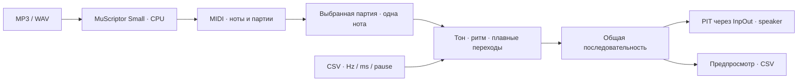

# Speaker Studio

Я хотел заставить пищалку материнской платы проиграть музыку из Windows. Началось
всё с одной команды `Beep`, которая упрямо звучала через колонки монитора.
Закончилось приложением, локальной моделью MP3 → MIDI и исследованием того,
как сохранить мелодию, когда в каждый момент можно выдать только одну частоту.

На тестовом ПК физический speaker заработал через InpOut и PIT. Дальше самым
интересным оказалось выбрать нужные ноты из многоголосной записи и переключать
их вовремя. Здесь я собрал рабочий инструмент и результаты этих экспериментов.


## Скачать и запустить

**[Готовое приложение с MuScriptor Small — версия 2.0.1](https://github.com/esinkirill/speaker-studio/releases/tag/v2.0.1)**

Нужна **Windows 10 22H2 или Windows 11, x64**. В архив уже входят модель,
Python с PyTorch CPU, Node и InpOut. Отдельно устанавливать Python, Node или
Visual Studio для запуска не нужно.

1. Скачай `SpeakerStudio-2.0.1-win-x64-with-model.zip` из **Assets** и распакуй
   целиком в папку, где можно сохранять файлы.
2. Если на ПК нет актуального Visual C++ x64 runtime, установи
   [официальный пакет Microsoft](https://aka.ms/vc14/vc_redist.x64.exe).
   Он нужен Python и нативным библиотекам модели; на многих ПК уже установлен.
3. Один раз запусти **`Prepare-Audio.cmd`**. Он скачает фиксированные версии
   сборки FFmpeg от BtbN и Essentia.js из npm, проверит контрольные суммы и
   разместит их рядом с приложением. Интернет нужен на этом шаге.
4. Открой **`SpeakerStudio.exe`**. После подготовки MP3 → MIDI работает локально
   на CPU, без отправки музыки на сервер.

Чтобы услышать именно пищалку, она должна быть подключена к **Speaker/Buzzer**
по руководству своей платы. Для физического выхода нужны права administrator:
InpOut использует kernel driver для доступа к I/O-портам. Через обычные колонки
можно сначала послушать предпросмотр. На платах без нужного аппаратного пути
одна DLL пищалку не создаст.

## От записи до пищалки

Я оставил полный MIDI промежуточным результатом: так можно выбрать партию
инструмента, а не пытаться сразу превратить весь MP3 в один ряд частот.



Практический маршрут: добавить MP3 на вкладке конвертации → получить MIDI →
выбрать ведущую партию в библиотеке → послушать → сохранить CSV для пищалки.
Если MIDI уже хороший, первые два шага не нужны.

MIDI сохраняет многоголосие. Для speaker я беру верхнюю активную ноту выбранной
партии, пропускаю ударные и сохраняю повторные атаки. Это понятное правило,
но выбор ведущего инструмента всё ещё важен: самая высокая нота всей записи
легко оказывается гармоникой или украшением вместо мелодии.

## Какую модель я встроил

Использую **[MuScriptor Small](https://huggingface.co/MuScriptor/muscriptor-small)**
от **Kyutai × Mirelo**: около 103 млн параметров, файл весов около 412 MB.
Я не обучал свою модель — встроил готовую через прямой Python API и написал
адаптер между ней и Windows приложением.

FFmpeg превращает запись в mono 16 kHz. MuScriptor обрабатывает её кусками по
5 секунд и возвращает события нот с группами инструментов. Мой exporter
сохраняет их в MIDI, обрезает окончания по длине записи и отдельно переносит
оценку BPM. Тишина в начале не удаляется автоматически.

Модель включена в релиз вместе с CPU runtime. Это избавляет от подготовки
Python environment, но CPU-конвертация не мгновенная: в моих опытах фрагмент
около 20 секунд обрабатывался примерно две минуты. Устройство интеграции,
размещение файлов и сборка своего runtime — в **[MODEL.md](docs/MODEL.md)**.

## Что оказалось неожиданным

### Высокая нота не всегда мелодия

В одной записи группы нот расходились примерно на 19 полутонов — почти
соотношение частот 3:1, характерное для третьей гармоники. Простой выбор
максимума спектра поэтому давал убедительные частоты, но не нужную мелодию.

Я сравнил **144 варианта**: спектральные методы, Basic Pitch, YourMT3,
MuScriptor и разные способы свести многоголосие к одной линии. Проверял
целостность MIDI, длительности и совпадение результатов между методами.
Размеченной эталонной мелодии у меня не было, поэтому совпадение двух моделей
не называю доказательством музыкальной точности.

### BPM нельзя получить из количества строк CSV

Строка — событие с длительностью, а не музыкальная доля. BPM я читаю из MIDI
или отдельно оцениваю по audio. Для равномерной сетки использую:

```text
шаг, мс = 60000 / BPM / частей на четверть
```

При 120 BPM и четырёх частях это 125 мс. Сетка выравнивает моменты переключения;
изменение целевого BPM масштабирует время. Это разные операции.

Разделение нот тоже не должно незаметно удлинять трек: если добавляю 10 мс
тишины, забираю их из длительности звучания. Для плавного перехода между
соседними нотами интерполирую **логарифм частоты** по smoothstep; настоящие
паузы сохраняю. Это меняет переход высоты, но не возвращает тембр исходного MP3.

### Миллисекунды накапливаются

Если после каждой ноты просто ждать её длительность, время работы программы
добавляется к музыке. Поэтому плеер идёт по абсолютным срокам общего `Stopwatch`:
следующее событие привязано к позиции трека. Эту же временную модель используют
перемотка, пауза, диаграмма и экспорт.

Подробности, числа и неудачные подходы я сохранил в **[RESEARCH.md](docs/RESEARCH.md)**.

## Собрать из исходников

GUI написан на C# / WinForms и собирается штатным компилятором .NET Framework 4.
NuGet и Visual Studio для этой сборки не нужны.

```powershell
git clone https://github.com/esinkirill/speaker-studio.git
cd speaker-studio
.\speaker-player\build.ps1
.\speaker-player\SpeakerStudio.exe
```

Исходники не содержат большие binary dependencies. Чтобы получить все функции
в своей сборке, скопируй из готового релиза `runtime/`, `models/`, `licenses/`,
`inpout32.dll` и `inpoutx64.dll` в `speaker-player/`, затем запусти находящийся
там `Prepare-Audio.cmd`. Если аудиоинструменты уже подготовлены в релизе,
скопируй также `assets/ffmpeg/`.

Для проверки core без модели и hardware:

```powershell
.\speaker-player\test.ps1
.\speaker-player\test.ps1 -Platform x86
```

Есть искусственный [demo.csv](examples/demo.csv), который можно открыть в
визуальном режиме. Что проверено тестами и что остаётся аппаратным
экспериментом, описано в [VERIFICATION.md](docs/VERIFICATION.md).

## Где читать дальше

| Документ | Содержание |
| --- | --- |
| [MODEL.md](docs/MODEL.md) | Модель, CPU runtime, интеграция и собственная сборка |
| [RESEARCH.md](docs/RESEARCH.md) | PIT, гармоники, BPM и 144 варианта конвертации |
| [ARCHITECTURE.md](docs/ARCHITECTURE.md) | Временная модель, процессы, события и экспорт |
| [CSV_FORMAT.md](docs/CSV_FORMAT.md) | Три столбца, миллисекунды и metadata |
| [USER_GUIDE.md](docs/USER_GUIDE.md) | Работа с треками и настройками звучания |
| [DEPENDENCIES.md](docs/DEPENDENCIES.md) | Версии и источники компонентов |

Следующий интересный шаг для меня — выбирать ведущую линию по непрерывности
мелодии, а не только по высоте, и сравнивать результат с вручную размеченными
нотами. Напряжением speaker я пока не управляю: доля звучания в ячейке сетки
не является регулировкой напряжения или настоящим ползунком громкости.

Мой код — [MIT](LICENSE). Благодарности MuScriptor / Kyutai × Mirelo, InpOut,
FFmpeg, Essentia и авторам Python ecosystem; их notices сохранены в комплекте.
Веса MuScriptor Small — CC BY-NC 4.0, для некоммерческого использования.

