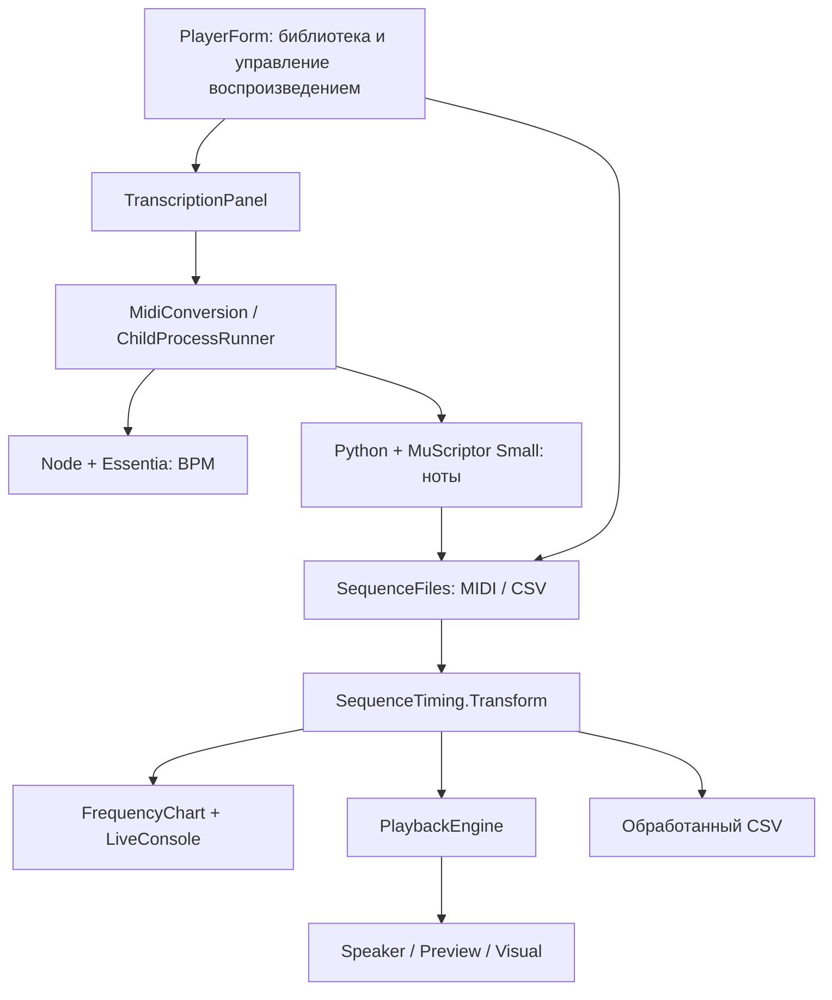
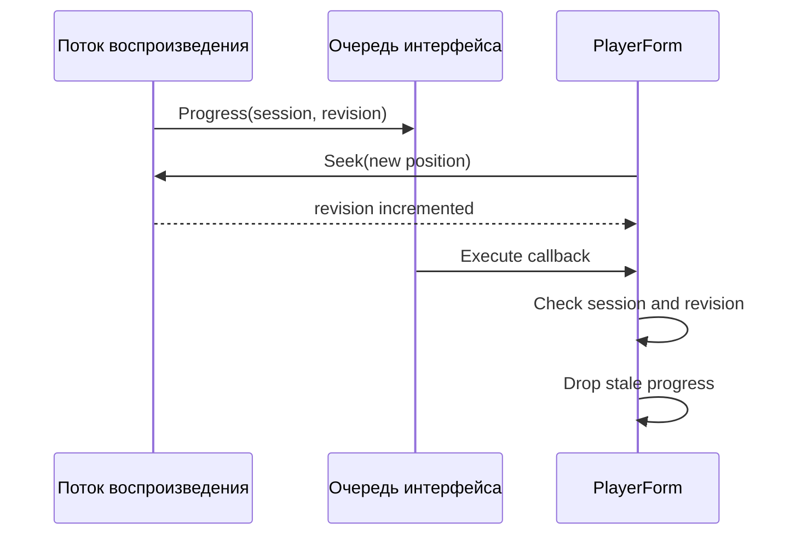

# Как устроен Speaker Studio

Speaker Studio — Windows Forms приложение на C# 5 / .NET Framework 4. C# управляет библиотекой и воспроизведением; Python распознаёт ноты через MuScriptor; Node оценивает BPM через Essentia.

График, воспроизведение и экспорт CSV работают с последовательностью `ToneRow` и общим расчётом высот и времени. Между C# и аудиоконвертером передаются полный MIDI и JSON-отчёты. Алгоритмы выбора мелодии рассматриваются в [исследовании обработки мелодии](RESEARCH.md).

## 1. Путь файла через приложение



MIDI и CSV сразу поступают в плеер. MP3/WAV сначала превращаются в полный MIDI с партиями. Из него выбирается один голос, а уже его события проходят через `SequenceTiming`.

Конвертер, алгоритм выбора одного голоса и выходной модуль разделены. Интерфейс запускает конвертацию в фоне и получает готовый MIDI; распознавание не выполняется в потоке воспроизведения.

## 2. Где искать код

Исходники находятся в `speaker-player/src`. Части `PlayerForm` разделены через `partial` по функциям и используют общее состояние плеера.

| Файл | Что в нём находится |
| --- | --- |
| [Program.cs](../speaker-player/src/Program.cs) | Точка входа с STA, базовая папка и запуск формы |
| [AssemblyInfo.cs](../speaker-player/src/AssemblyInfo.cs) | Название продукта и данные версии |
| [PlayerForm.cs](../speaker-player/src/PlayerForm.cs) | Загрузка, настройки, воспроизведение, экспорт и перезапуск с UAC |
| [PlayerStudio.cs](../speaker-player/src/PlayerStudio.cs) | Вкладки, управление воспроизведением, перемотка, окно ритма и подсказки |
| [PlayerLibrary.cs](../speaker-player/src/PlayerLibrary.cs) | Поиск, фильтры, выбор и удаление записей |
| [PlayerRhythm.cs](../speaker-player/src/PlayerRhythm.cs) | BPM, фаза, сетка и применение аудиоанализа |
| [LibraryStore.cs](../speaker-player/src/LibraryStore.cs) | Сохранение списка путей к файлам |
| [GeneratedFiles.cs](../speaker-player/src/GeneratedFiles.cs) | Понятные имена результатов и числовые суффиксы при совпадении |
| [TranscriptionPanel.cs](../speaker-player/src/TranscriptionPanel.cs) | Интерфейс конвертации, состояние, ход работы и отмена |
| [MidiConversion.cs](../speaker-player/src/MidiConversion.cs) | Цепочка BPM → транскрипция, чтение отчёта и проверка MIDI |
| [ChildProcessRunner.cs](../speaker-player/src/ChildProcessRunner.cs) | Аргументы процессов, stdout/stderr и отмена дерева процессов |
| [RhythmAnalysis.cs](../speaker-player/src/RhythmAnalysis.cs) | Чтение отчёта о ритме, BPM, долей и отклонений от сетки |
| [SequenceData.cs](../speaker-player/src/SequenceData.cs) | `ToneRow`, CSV и чтение Standard MIDI |
| [RhythmSettings.cs](../speaker-player/src/RhythmSettings.cs) | Режимы Original/Quantize/Chop и параметры перехода частоты |
| [SequenceTiming.cs](../speaker-player/src/SequenceTiming.cs) | Подготовка высот и временных событий |
| [Playback.cs](../speaker-player/src/Playback.cs) | Сеанс, отсчёт времени, перемотка, пауза, повтор и выходные модули |
| [PlayerVisuals.cs](../speaker-player/src/PlayerVisuals.cs) | Piano roll, график частот, выбранная и текущая позиции |
| [LiveConsole.cs](../speaker-player/src/LiveConsole.cs) | Журнал с прокруткой, копированием и очисткой |

Настройка, влияющая на события, включается в `Settings()`, общий расчёт, восстановление после UAC и экспорт обработанного CSV.

## 3. Формат событий

Последовательность для speaker описывает три числа:

```csharp
public sealed class ToneRow
{
    public int Frequency;
    public int DurationMs;
    public int PauseMs;
}
```

| Поле | Значение для плеера |
| --- | --- |
| `Frequency > 0` | Держать тон в течение `DurationMs` |
| `Frequency == 0` | REST длительностью `DurationMs` |
| `PauseMs` | Тишина после интервала |

Значения неотрицательны. Общая длина — сумма `DurationMs + PauseMs`. REST и пауза после ноты записываются по-разному, но при воспроизведении оба становятся тихими сегментами.

При сохранении CSV используется `;`, чтобы поля открывались в трёх столбцах Excel в соответствующей локали. Чтение поддерживает также запятую и табуляцию, с проверкой заголовка и значений.

```csv
frequency;duration;pause
440;200;20
660;150;0
0;100;0
```

Это формат событий для speaker. Полный MIDI содержит больше информации: одновременные ноты, партии и карту темпа.

### MIDI → последовательность одного голоса

`SequenceFiles` поддерживает SMF format 0/1 со временем в PPQN, running status, событиями темпа и `note-on velocity=0` как `note-off`. Карта темпа переводит MIDI ticks в абсолютные миллисекунды. Деление времени по SMPTE пока не поддерживается.

Активные голоса учитываются по высоте и каналу. В последовательность для speaker идёт верхняя активная нота выбранных музыкальных дорожек:

```text
frequency = round(440 × 2^((midiNote − 69) / 12))
```

Повторная атака выбранной высоты сохраняется. Событие более низкой ноты или смена темпа не дробят удерживаемый верхний голос. Ударные канала 10 исключаются; pitch bend, sustain/CC и динамика не моделируются нотным выходом speaker.

Необязательный маркер `muscriptor:bar_offset` попадает в `MidiTempoInfo.AudioBarOffsetSeconds` для сопоставления внешних MIDI с аудио. Начальная тишина не удаляется автоматически. Аудиоконвертер Speaker Studio пишет смещение 0 и сохраняет времена без дополнительного выравнивания до такта.

## 4. Общая подготовка звука, графика и файла

API подготовки:

```csharp
SequenceTiming.Transform(rows, transpose, speed, noteGapMs, rhythm)
```

Метод возвращает новые строки и не изменяет входные `ToneRow`. Это общий расчёт для графика, воспроизведения и обработанного CSV.

Порядок операций имеет значение:

1. Проверить параметры и скопировать вход.
2. Изменить высоту независимо от времени.
3. При Quantize подвинуть абсолютные внутренние границы.
4. Масштабировать накопленные границы и округлить их.
5. Вырезать разделительную паузу из конца звучащих исходных нот.
6. Сформировать плавный переход частоты между соседними звучащими нотами.
7. При Chop пересечь результат с абсолютной сеткой включения звука.

### Округлять границы, а не каждую длительность

Масштабируются накопленные границы. Длительность каждого интервала получается из разности соседних границ, поэтому отдельные округления строк не накапливаются:

```text
newBoundary[k] = round(sourceBoundary[k] / speed)
newDuration[k] = newBoundary[k+1] − newBoundary[k]
newTotal = round(sourceTotal / speed)
```

Quantize не сдвигает начало и конец трека. Внутренняя граница проходит 50% пути к ближайшей клетке; порядок остаётся монотонным. REST сохраняет свой тип, но его границы и длина могут измениться.

### BPM и фаза в исходной системе времени

BPM относится к четверти. `PartsPerBeat` принимает 1, 2, 3, 4, 6, 8, 12 или 16. `PhaseMs` — фаза в исходном таймлайне; при воспроизведении фаза и шаг делятся на `speed`.

```text
stepMs = 60000 / sourceBpm / partsPerBeat / speed
```

Исходный BPM берётся из карты темпа MIDI, сопутствующего файла CSV или аудиоанализа. Если значение неизвестно, его можно задать вручную. Tap при неизвестном BPM задаёт исходный темп; при известном меняет скорость относительно него.

Ровная сетка отключается при неизвестном BPM, переменном темпе или шаге меньше 1 мс. Обычное изменение скорости продолжает масштабировать исходный ритм вместе со сменами темпа.

### Gap, glide и Chop

Разделительная пауза (gap) после изменения скорости ограничена `D−1` для непустой звучащей ноты. Она уменьшает время звука и увеличивает паузу после ноты на ту же величину; REST дополнительной паузы не получает.

`GlideMs` — время перехода уже после изменения скорости. Переход занимает начало следующей ноты. Частоты вычисляются по логарифмической интерполяции с cubic smoothstep `3u²−2u³`; первый и последний шаги соответствуют соседним высотам. Настройка разрешения — 5/10/20/50 мс.

Настоящая пауза, REST или gap запрещают glide через эту границу. Glide применяется до Chop, поэтому искусственные gate-разрывы не создают новые переходы между нотами.

Chop сохраняет исходные тихие интервалы и работает внутри звучащих. «Звук 90%» задаёт долю звучания клетки. Результат glide/chop ограничен 200000 участками: слишком мелкая сетка заканчивается понятной ошибкой, а не огромным списком в памяти.

## 5. Воспроизведение и перемотка

При `Play` движок фиксирует настройки и подготовленные события для нового сеанса. `PreparedSegment` хранит абсолютные `Start`/`End`, а позиция ищется в отсортированном таймлайне.

`ActiveClock` использует `Stopwatch`, точку начала отсчёта и смещение позиции. Пользовательская пауза исключается из времени воспроизведения. Seek пересчитывает начало отсчёта и сохраняет состояние паузы. Поток воспроизведения ждёт оставшееся время до абсолютного конца сегмента.

Это убирает накопление времени работы выходного модуля и обработчиков событий на каждой ноте. Планировщик Windows может задержать переключение, особенно на коротких сегментах. [Microsoft о точном измерении времени](https://learn.microsoft.com/en-us/windows/win32/sysinfo/acquiring-high-resolution-time-stamps), [Sleep](https://learn.microsoft.com/en-us/windows/win32/api/synchapi/nf-synchapi-sleep).

| Действие | Результат |
| --- | --- |
| Старт внутри ноты | Играть оставшуюся часть |
| Старт внутри REST или паузы | Дождаться конца тихого интервала |
| Перемотка во время воспроизведения | Перейти к позиции, сохранив выходной модуль и сеанс |
| Перемотка во время паузы | Обновить позицию, сохранив паузу |
| Старт в конце | Завершиться без открытия выходного модуля |
| Повтор после выбранного хвоста | Следующий проход начинается с нуля |

### Обновление позиции и очередь интерфейса

`BeginInvoke` ставит обновление позиции в очередь интерфейса. Между отправкой и выполнением обработчика пользователь может перемотать трек: `SessionId` остаётся прежним, но позиция меняется.

`PositionRevision` меняется при перемотке и повторе. Обработчик в потоке интерфейса сверяет сеанс и ревизию позиции; устаревшее обновление отбрасывается.



Завершение также проверяется по сеансу, чтобы старый поток не завершил новый запуск в интерфейсе. Отмена будит поток через состояние сеанса и события; выходной модуль закрывается через `finally`/`Dispose`.

## 6. Три выхода с общим управлением

| Выход | Реализация | Назначение |
| --- | --- | --- |
| Speaker | `SpeakerOutput`: InpOut, PIT channel 2, gate | Физическая пищалка |
| Preview | `WaveOutput`: Windows waveOut | Нотная линия через обычное аудиоустройство |
| Visual | `SilentOutput` | Работа плеера и графика без звука и DLL |

Выход Speaker выбирает DLL по разрядности процесса и получает функции `Inp32`, `Out32`, `IsInpOutDriverOpen`. Каталог DLL находится относительно базы приложения. Выходной модуль открывается при Play, поэтому Visual не обращается к драйверу.

Для физического режима нужен процесс с правами администратора и speaker, подключённый к соответствующему разъёму платы. Перезапуск с UAC сохраняет параметры и позицию; воспроизведение пользователь запускает повторно.

Piano roll и кривая частоты строятся из подготовленных событий. Это помогает увидеть, какие события плеер передаёт на выход, но напряжение и акустический результат график не измеряет.

## 7. MP3 → MIDI в отдельных процессах

У конвертера две точки входа:

| Скрипт | Что делает |
| --- | --- |
| [analyze-rhythm.cjs](../speaker-player/converter/analyze-rhythm.cjs) | Аудио → одноканальный PCM 44100 Гц → JSON с BPM, долями и сеткой Essentia |
| [transcribe-midi.py](../speaker-player/converter/transcribe-midi.py) | Аудио → одноканальный PCM 16000 Гц → события MuScriptor → MIDI и отчёт |

`MidiConversion` сначала пробует определить BPM. Если анализ ритма не удался, транскрипция продолжается. Значение 120 тогда служит только опорным темпом для записи MIDI ticks; метаданные остаются `unknown`, интерфейс не показывает его как найденный BPM.

Python загружает локальные safetensors/config и выполняет распознавание на CPU. Работа с сетью и автоматическое использование токена учётной записи отключены. `-I -B` изолируют интерпретатор и запрещают создание кешей байткода. Конвертер не запускает звук.

События модели обрезаются по длительности аудио. Наложения одной высоты в одной инструментальной партии устраняются нормализацией. Полный MIDI сохраняет одновременные высоты и партии; если тональных групп больше 15, MIDI-каналы используются повторно.

### Отмена, аргументы и готовый результат

`TranscriptionPanel` запускает конвертацию через `ThreadPool`, а состояние и ход работы передаёт в поток интерфейса. Отмена подготавливается до постановки работы в очередь. `ChildProcessRunner` собирает и экранирует аргументы, читает stdout/stderr и завершает созданное дерево процессов при отмене.

Результат принимается после проверки кода завершения, схемы отчёта, ожидаемого пути, наличия MIDI и успешного чтения встроенным MIDI-парсером.

Имена результатов получают числовой суффикс при совпадении. Python создаёт MIDI и отчёт только как новые файлы, исключая перезапись, в том числе совпадение с исходником. Два процесса не могут занять одно имя; общей очереди между экземплярами приложения нет.

## 8. Библиотека и два вида CSV

`data/library.json` хранит пути зарегистрированных файлов. Внутренние пути относительны базе приложения, внешние остаются внешними. Удалить запись из библиотеки можно, сохранив файл на диске. Эффекты в библиотеке не сохраняются.

Запись библиотеки использует временный файл и `File.Replace` либо `File.Move`. Если запись не удалась, соответствующее изменение списка в памяти откатывается. Между несколькими экземплярами приложения нет блокировки общей библиотеки.

С CSV есть важное различие:

- «Создать CSV» сохраняет исходную одноголосную проекцию MIDI.
- «Сохранить CSV» вызывает общий расчёт и записывает применённые тон, скорость, разделение нот, ритм и плавные переходы.

Экспорт не позволяет заменить выбранный исходный файл. При загрузке обработанного CSV эффекты сбрасываются к нейтральным значениям — иначе они применились бы дважды.

Сопутствующие текстовые файлы дописывают суффикс к полному имени CSV:

| Суффикс | Данные |
| --- | --- |
| `.bpm.txt` | Исходный либо уже масштабированный BPM |
| `.bpm-varies.txt` | Отметка о переменном темпе |
| `.grid-phase.txt` | Фаза в миллисекундах |
| `.audio-offset.txt` | Необязательное смещение относительно аудио в секундах |
| `.processed.txt` | Эффекты уже применены |

JSON-отчёты используют замену расширения на `.transcription.json` и `.rhythm.json`. Сами CSV остаются простыми и редактируемыми вручную; формат подробнее описан в [описании формата CSV](CSV_FORMAT.md).

## 9. Окружение и расположение компонентов

В [релизе 2.0.2](https://github.com/esinkirill/speaker-studio/releases/tag/v2.0.2) модель, окружение Python для CPU и Node включены в архив. Для нативных библиотек Python/Torch нужен системный VC14 x64. `Prepare-Audio.cmd` получает FFmpeg и Essentia.js по фиксированным адресам, проверяет SHA256/SHA512 скачанных архивов и размещает компоненты относительно EXE.

Python использует `python312._pth` с локальными `Lib/`, `DLLs/` и `site-packages/`. Модель находится в `models/muscriptor-small/`. Установка и сборка окружения описаны в [руководстве по модели](MODEL.md); версии компонентов — в [списке зависимостей](DEPENDENCIES.md).

[Скрипт сборки окружения](../speaker-player/scripts/build-transcription-runtime.py) копирует подготовленные файлы и создаёт `runtime-manifest.json` с путями, размерами и SHA256. По умолчанию он использует системный VC14; `--vc-runtime` задаёт каталог DLL для размещения рядом с приложением и сопутствующих лицензий. Скрипт не скачивает модель и не устанавливает пакеты.

Исходники и тесты с искусственными данными находятся в Git, модель с окружением — в архиве релиза. Запуск тестов описан в [руководстве по тестам](../speaker-player/tests/README.md).

## 10. Точки расширения

| Функция | Место в коде | Контракт |
| --- | --- | --- |
| Другой алгоритм выбора одного голоса | `SequenceFiles` либо отдельный обработчик полного MIDI | Повторные атаки, REST, высоты и границы нот |
| Новый временной эффект | `SequenceTiming` | Длительность, фазу и округление; совпадение графика, экспорта и воспроизведения |
| Карта долей для переменного темпа | `RhythmAnalysis` и общий расчёт | Нерегулярные доли, фаза и смены темпа |
| Другая модель транскрипции | Конвертер + `MidiConversion` | Отмена, имена файлов, MIDI и схема отчёта |
| Воспроизведение произвольного сигнала | Новый `IToneOutput` и при необходимости другая модель событий | Время переключения, остановка и аппаратное измерение |
| Громкость | Сначала определённый аппаратный интерфейс | Измеренный способ изменения амплитуды |

Музыкальные преобразования работают с обычными событиями и не требуют открывать I/O-порты. Аппаратный вывод подключается через `IToneOutput` к уже подготовленной последовательности.
