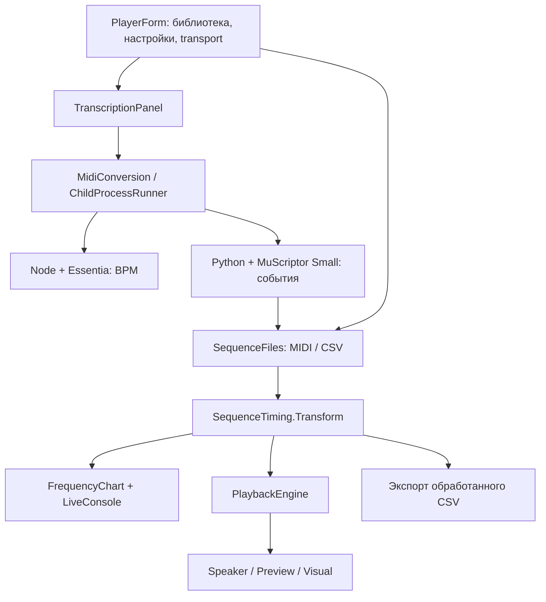
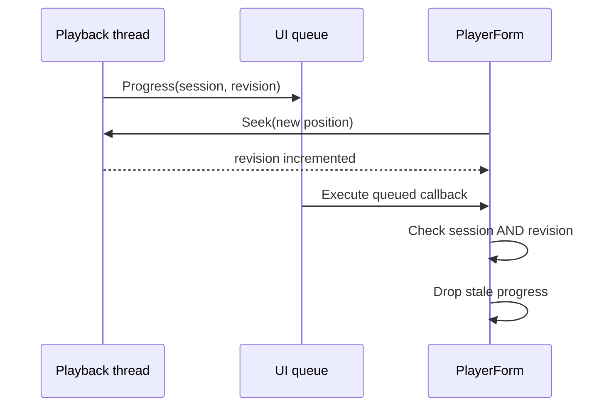

# Архитектура Speaker Studio 2.0

Speaker Studio — Windows Forms приложение на C# 5 / .NET Framework 4. Оно соединяет нотный player, локальную аудиотранскрипцию и общий расчёт событий. В основе лежит простая последовательность `ToneRow`, а hardware output является одним из трёх backend.

Документ описывает текущие исходники. Результаты исследования и пределы подтверждённой совместимости находятся в [RESEARCH.md](RESEARCH.md).

## 1. Слои и поток данных



Распознавание аудио не выполняется в playback thread. GUI передаёт его отдельным процессам; player получает уже готовые события. Это позволяет независимо менять converter, mono selector, временные эффекты и backend.

## 2. Карта 18 production исходников

Все перечисленные файлы находятся в `speaker-player/src`.

| Файл | Ответственность |
| --- | --- |
| [Program.cs](../speaker-player/src/Program.cs) | STA entry point, базовая папка приложения, запуск формы |
| [AssemblyInfo.cs](../speaker-player/src/AssemblyInfo.cs) | Product/version metadata |
| [PlayerForm.cs](../speaker-player/src/PlayerForm.cs) | Координация загрузки, настроек, playback, экспорта и UAC restart |
| [PlayerStudio.cs](../speaker-player/src/PlayerStudio.cs) | Две вкладки, компактные настройки, transport, seek, окно ритма и подсказки |
| [PlayerLibrary.cs](../speaker-player/src/PlayerLibrary.cs) | Поиск, фильтры, выбор и удаление записей библиотеки |
| [PlayerRhythm.cs](../speaker-player/src/PlayerRhythm.cs) | BPM/phase, musical grid, локальный анализ ритма и его применение |
| [LibraryStore.cs](../speaker-player/src/LibraryStore.cs) | Persistent список путей к файлам |
| [GeneratedFiles.cs](../speaker-player/src/GeneratedFiles.cs) | Читаемые уникальные имена результатов |
| [TranscriptionPanel.cs](../speaker-player/src/TranscriptionPanel.cs) | UI конвертации, progress/status, отмена и событие нового MIDI |
| [MidiConversion.cs](../speaker-player/src/MidiConversion.cs) | Запуск анализа BPM и аудиотранскрипции, чтение отчёта, валидация MIDI |
| [ChildProcessRunner.cs](../speaker-player/src/ChildProcessRunner.cs) | Quoting, redirect stdout/stderr, cancellation и завершение дерева процессов |
| [RhythmAnalysis.cs](../speaker-player/src/RhythmAnalysis.cs) | Проверка rhythm JSON, BPM, beat positions, fit и residuals |
| [SequenceData.cs](../speaker-player/src/SequenceData.cs) | `ToneRow`, CSV reader/writer и Standard MIDI parser |
| [RhythmSettings.cs](../speaker-player/src/RhythmSettings.cs) | Параметры Original/Quantize/Chop и glide |
| [SequenceTiming.cs](../speaker-player/src/SequenceTiming.cs) | Единая подготовка pitch и временных событий |
| [Playback.cs](../speaker-player/src/Playback.cs) | Playback session, monotonic clock, seek/pause/loop и outputs |
| [PlayerVisuals.cs](../speaker-player/src/PlayerVisuals.cs) | Piano roll, frequency timeline, selection и playhead |
| [LiveConsole.cs](../speaker-player/src/LiveConsole.cs) | Ограниченный журнал с прокруткой, копированием и очисткой |

Части `PlayerForm` разделены по функциям через `partial`, а не через разные независимые состояния плеера. Новая настройка должна попасть в `Settings()`, shared transform, восстановление после UAC и экспорт, если она влияет на события.

## 3. Контракт данных

```csharp
public sealed class ToneRow
{
    public int Frequency;
    public int DurationMs;
    public int PauseMs;
}
```

| Поле | Значение |
| --- | --- |
| `Frequency > 0` | Удерживать заданную частоту в течение `DurationMs` |
| `Frequency == 0` | REST длительностью `DurationMs` |
| `PauseMs` | Дополнительная тишина после этого интервала |

Все значения неотрицательны. Полная длительность — сумма `DurationMs + PauseMs` всех строк. REST и pause могут быть представлены разными полями, но при подготовке playback оба становятся тихими сегментами.

CSV имеет заголовок `frequency;duration;pause`. Writer использует `;`, чтобы при стандартном открытии в соответствующей локали Excel поля находились в трёх столбцах. Reader также понимает запятую и табуляцию и проверяет значения. Это формат speaker player; он отличается от CSV полного списка MIDI events.

```csv
frequency;duration;pause
440;200;20
660;150;0
0;100;0
```

### MIDI → mono

`SequenceFiles` читает SMF format 0/1 с PPQN timing, running status, tempo events и `note-on velocity=0` как `note-off`. SMPTE time division не поддерживается. Tempo map переводит ticks в абсолютные миллисекунды.

Активные голоса учитываются по pitch и channel. Верхняя активная нота выбранных музыкальных дорожек определяет текущую частоту:

```text
frequency = round(440 × 2^((midiNote − 69) / 12))
```

Channel 10 percussion не попадает в speaker sequence. Повторные атаки выбранной ноты сохраняются; посторонний low-pitch event или tempo event не дробит неизменившийся sustain. Pitch bend, sustain/CC и выразительная динамика не моделируются аппаратным нотным выходом.

`MidiTempoInfo.AudioBarOffsetSeconds` сохраняет optional `muscriptor:bar_offset` для сопоставления с аудио. Parser не удаляет этот участок таймлайна автоматически. В новом production converter bar offset равен нулю: исходные времена сохраняются без искусственного тактового padding.

## 4. Единая подготовка последовательности

Основной API:

```csharp
SequenceTiming.Transform(rows, transpose, speed, noteGapMs, rhythm)
```

Метод создаёт новую последовательность и не изменяет входные `ToneRow`. Одни и те же правила используются для chart, playback и processed CSV, чтобы разные части UI не рассчитывали свою длительность.

Порядок обработки:

1. Проверить параметры и скопировать исходные строки.
2. Изменить pitch независимо от скорости.
3. При Quantize мягко скорректировать абсолютные внутренние границы.
4. Масштабировать cumulative boundaries и округлить их.
5. Вырезать note gap из конца звучащих исходных нот.
6. Добавить glide только между непосредственно соседними звучащими нотами.
7. При Chop пересечь полученные звучащие интервалы с абсолютной сеткой gate.

### Округление без накопления ошибки

Если отдельно округлять длительность каждой строки, ошибки на длинном файле складываются. Поэтому сначала преобразуются накопленные границы:

```text
newBoundary[k] = round(sourceBoundary[k] / speed)
newDuration[k] = newBoundary[k+1] − newBoundary[k]
newTotal = round(sourceTotal / speed)
```

Начало и конец общего таймлайна не сдвигаются при Quantize. Внутренняя граница движется на половину расстояния до ближайшей клетки; порядок остаётся монотонным. Границы REST могут переместиться, но REST не заменяется звучащей нотой.

### Фаза и musical grid

`PartsPerBeat` принимает 1, 2, 3, 4, 6, 8, 12 или 16. BPM относится к четверти; триольные варианты задаются 3/6/12 частями. `PhaseMs` находится в исходном таймлайне; при воспроизведении и шаг, и фаза делятся на `speed`.

GUI отключает ровную сетку при неизвестном BPM, variable tempo или шаге меньше 1 мс. Обычное масштабирование скорости продолжает сохранять относительные изменения tempo map.

Source BPM берётся из MIDI tempo map, CSV sidecar или аудиоанализа; его можно задать вручную, когда значение неизвестно. Tap при неизвестном BPM устанавливает source BPM, а при известном — меняет скорость относительно него.

### Note gap, glide и Chop

Gap ограничивается `D−1` для непустой звучащей ноты. Он уменьшает звук и увеличивает pause на ту же величину. Исходный REST не получает новый gap.

`GlideMs` измеряется в миллисекундах уже масштабированного playback. Переход занимает начало следующей ноты, не удлиняя её. Частоты вычисляются через log interpolation и cubic smoothstep; первый и последний шаги соответствуют соседним высотам. Наличие настоящей паузы или gap запрещает переход через неё.

Glide применяется **до** Chop: искусственные gate-разрывы не превращаются в новые музыкальные атаки для portamento. Chop работает только внутри звучащих интервалов, с сохранением исходных quiet intervals. Заполнение 90% обозначает время звучания клетки, а не voltage.

Обработки glide/chop ограничивают рост результата 200000 участками. При слишком мелкой сетке выдаётся понятная ошибка вместо создания огромного списка.

## 5. Playback, pause и seek

При `Play` engine копирует настройки и подготовленные события в session snapshot. Строки превращаются в `PreparedSegment` с абсолютными `Start`/`End`. Быстрый поиск позиции использует отсортированный таймлайн.

`ActiveClock` построен на `Stopwatch`: он хранит origin, position offset и исключённое время пользовательской паузы. После seek origin пересчитывается; paused state сохраняется. Один clock обслуживает весь playback, а ожидание для каждого сегмента определяется оставшимся временем до абсолютного конца.

Это предотвращает систематическое прибавление затрат output/observer к каждой ноте. Но `Stopwatch` измеряет время, а не гарантирует точность Windows scheduling. Поздно начавшийся короткий сегмент может получить меньше фактического звучания или быть пропущен. [Microsoft: high-resolution timestamps](https://learn.microsoft.com/en-us/windows/win32/sysinfo/acquiring-high-resolution-time-stamps), [Sleep и scheduling](https://learn.microsoft.com/en-us/windows/win32/api/synchapi/nf-synchapi-sleep).

Контракт перемотки:

| Случай | Поведение |
| --- | --- |
| Start внутри tone | Играть только оставшуюся часть |
| Start внутри REST/pause | Дождаться конца тихого интервала |
| Seek во время playback | Сохранить backend и session, перейти к выбранному месту |
| Seek во время pause | Сохранить pause, обновить позицию |
| Start в конце | Завершиться без открытия output |
| Loop после выбранного хвоста | Следующий проход начинается с нуля |

### Почему нужны два идентификатора

`SessionId` отличает один запуск от другого. `PositionRevision` отличает позиции внутри той же session: seek и loop меняют revision. Поскольку `BeginInvoke` ставит callback в UI очередь, его актуальность проверяется **при выполнении в UI thread**, а не только до отправки.



Completion также проверяется по session, чтобы конец старого worker не завершил новый playback в UI. Cancellation и wake-up используют session state и события; завершение output проходит через `finally`/`Dispose`.

## 6. Output backends

| Backend | Реализация | Для чего используется |
| --- | --- | --- |
| Speaker | `SpeakerOutput`: InpOut, PIT channel 2, gate | Физическая пищалка |
| Preview | `WaveOutput`: Windows waveOut | Проверка нот через обычное аудиоустройство |
| Visual | `SilentOutput` | Проверка транспорта и диаграммы без звука и DLL |

Для Speaker выбирается InpOut DLL по разрядности текущего процесса, разрешаются exports `Inp32`, `Out32`, `IsInpOutDriverOpen`. Backend открывается при playback, а не при запуске GUI. Выбор native directory привязан к базе приложения.

UAC restart сохраняет пользовательские параметры и позицию. Новый elevated процесс не начинает воспроизведение автоматически. Возможность загрузить DLL, прочитать порт или открыть driver сама по себе не подтверждает физический звук.

Piano roll и frequency curve — разные представления подготовленных событий. Они не являются feedback от speaker и не измеряют аппаратный timing, напряжение или громкость.

## 7. Локальная MP3 → MIDI цепочка

Актуальны два scripts:

| Script | Вход / выход |
| --- | --- |
| [analyze-rhythm.cjs](../speaker-player/converter/analyze-rhythm.cjs) | Audio → mono PCM 44100 Hz → Essentia BPM / beats / fit JSON |
| [transcribe-midi.py](../speaker-player/converter/transcribe-midi.py) | Audio → mono PCM 16000 Hz → MuScriptor events → polyphonic MIDI и report |

`MidiConversion` сначала пробует BPM analysis. Ошибка ритма не запрещает транскрипцию: при неизвестном BPM nominal 120 используется лишь для tick conversion, а metadata сохраняет unknown status. GUI не показывает такой clock reference как измеренный source BPM.

Python entry point использует local safetensors/config, CPU inference, offline flags и исключает implicit account token. При запуске передаются `-I -B`: изоляция interpreter и запрет новых bytecode caches. Конвертация не запускает playback.

События модели обрезаются по реальной длительности аудио; наложения одной высоты в одной инструментальной партии устраняются нормализацией. Полный MIDI сохраняет партии и одновременные высоты. Если тональных групп больше 15, MIDI channels могут использоваться повторно; это ограничение формата экспорта, а не дополнительные независимые MIDI каналы.

### Процессы и результаты

`TranscriptionPanel` запускает bridge в `ThreadPool` и переводит status/progress обратно через UI dispatch. `ChildProcessRunner` использует structured argument construction/quoting, redirect stdout/stderr и cancellation всего созданного process tree. Подготовка cancellation выполняется до постановки worker в очередь.

Результат принимается после проверки exit code, схемы report, ожидаемого output path, существования MIDI и чтения реальным player parser. Успешный exit code без корректного файла не считается завершённой конвертацией.

Имя результата выбирается с suffix при совпадении. Python создаёт report/MIDI эксклюзивно и отвергает overwrite, включая совпадение с исходником. Это защищает от гонки двух конвертаций за одно имя; глобальная очередь нескольких экземпляров приложения не реализована.

## 8. Библиотека и processed export

`data/library.json` хранит список путей зарегистрированных файлов; настройки эффектов в нём не сохраняются. Пути внутри базы приложения сохраняются относительно неё; внешние пути остаются внешними. Удаление записи не удаляет MIDI/CSV/audio с диска.

Сохранение library использует временный файл и `File.Replace` либо `File.Move`. При ошибке записи откатывается соответствующее изменение in-memory списка. Это приложение с локальным состоянием; одновременная согласованная запись библиотеки из нескольких экземпляров не гарантируется.

«Создать CSV» сохраняет исходную mono-проекцию MIDI. «Сохранить CSV» вызывает общий transform и записывает уже применённые pitch/speed/gap/rhythm/glide. Экспорт запрещает заменять выбранный исходный файл.

Дополнительные текстовые sidecars дописывают суффикс к полному имени CSV:

| Суффикс | Содержимое |
| --- | --- |
| `.bpm.txt` | Исходный или уже масштабированный BPM |
| `.bpm-varies.txt` | Отметка о переменном tempo map |
| `.grid-phase.txt` | Фаза в миллисекундах |
| `.audio-offset.txt` | Optional audio offset в секундах |
| `.processed.txt` | Эффекты уже применены к значениям CSV |

Отчёты аудиоконвертации и анализа ритма — отдельные JSON с заменой расширения на `.transcription.json` и `.rhythm.json`. При загрузке processed CSV эффекты сбрасываются в neutral settings, чтобы не применить их дважды.

## 9. Portable runtime и воспроизводимость

Локально проверенный комплект содержит Python 3.12.14, torch 2.8.0+cpu, NumPy 1.26.4, Node, Essentia, FFmpeg и app-local MSVC 14.51.36231.0. Model source revision и SHA256 фиксируются manifest. Builder копирует явные build inputs; его наличие не означает автоматическое скачивание или принятие model terms.

Изоляция окружения не доказывает DLL closure. После обнаружения скрытого системного `msvcp140.dll` проверили ordinary/delay imports и фактические пути всех VC14 modules. Публичный `torch.testing` и package resources сохраняются как часть проверенного dependency component; удалять их только по имени папки нельзя.

Проверка ZIP/folder hash доказывает сохранность состава. Load smoke доказывает запуск на проверенном host. Inference/MIDI reader подтверждают программную цепочку. Ни одна из этих проверок отдельно не подтверждает акустическую точность или совместимость каждой платы.

Репозиторий исходников и большой локальный portable комплект — разные артефакты. Пользовательские песни и необработанные private logs не являются частью публичной архитектурной документации. У model, InpOut, FFmpeg, Essentia, Python, Node и MSVC сохраняются собственные licenses/notices.

## 10. Где расширять приложение

| Задача | Точка расширения | Что проверить |
| --- | --- | --- |
| Новый mono selector | `SequenceFiles` либо отдельный selector после полного MIDI | Повторные атаки, REST, pitch/onset/offset reference |
| Новый временной эффект | `SequenceTiming` | Длительность, фазу, округление; chart/export/playback должны совпасть |
| Beat map для variable tempo | `RhythmAnalysis` и shared transform | Нерегулярные доли, phase, скорость, границы tempo changes |
| Другой transcriber | Новый converter + `MidiConversion` contract | Local/no-overwrite/cancel, полноту MIDI, report validation |
| Новый waveform backend | Отдельный `IToneOutput` и другая модель событий при необходимости | Реальный timing, mute/cancel и аппаратное измерение |
| Analog volume | Только после установленного hardware interface | Измеренный механизм; gate duty нельзя переименовать в voltage |

Первыми полезными следующими проверками остаются clean Windows VM, ручная разметка небольшого музыкального фрагмента и аппаратное A/B. Они закрывают разные вопросы и должны оставаться раздельными.
