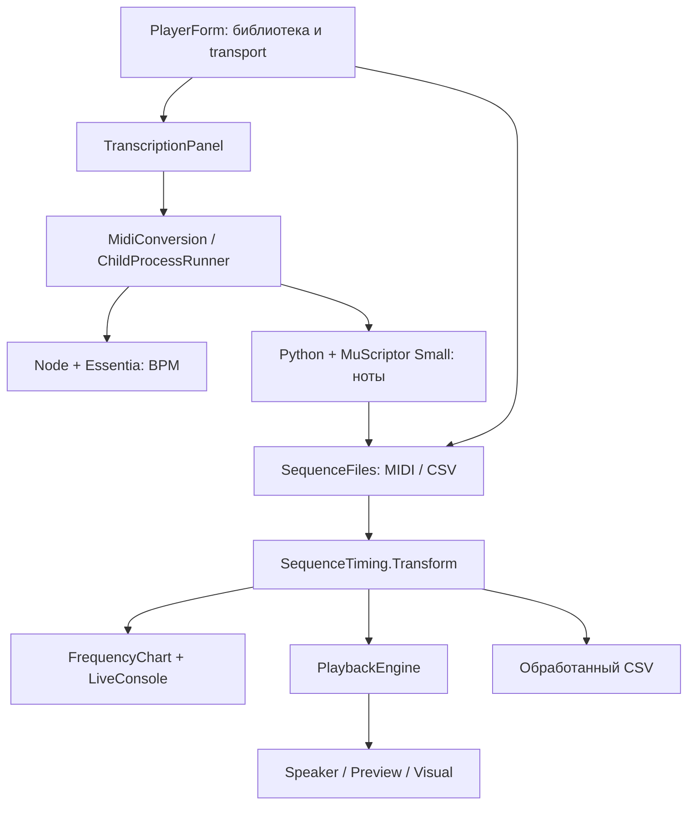
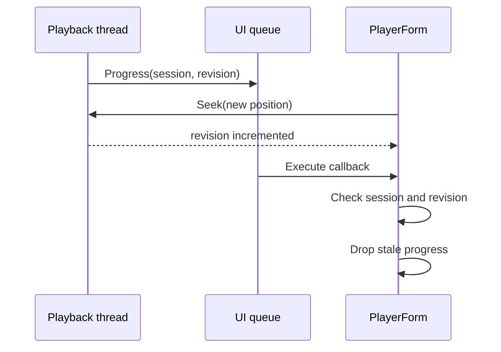

# Как устроен Speaker Studio

Я собрал Speaker Studio на C# 5 / .NET Framework 4 и Windows Forms. Мне нужен был небольшой Windows player, где можно выбрать файл, изменить тон и ритм, увидеть события и отправить их на speaker. Конвертацию аудио оставил отдельным процессам: Python отвечает за MuScriptor, Node — за анализ BPM.

Основная идея кода — сначала получить последовательность `ToneRow`, затем один раз рассчитать её pitch и время. График, playback и экспорт используют одинаковые правила. История опытов и результаты сравнения алгоритмов находятся в [RESEARCH.md](RESEARCH.md).

## 1. Путь файла через приложение



MIDI и CSV сразу поступают в player. MP3/WAV сначала превращаются в полный MIDI с партиями. Из него выбирается один голос, а уже его события проходят через `SequenceTiming`.

Так я могу менять transcriber, mono selector или output отдельно. Распознавание не тормозит playback thread: GUI запускает converter в фоне и получает готовый файл.

## 2. Где искать код

В `speaker-player/src` — 18 production файлов. Форму я разделил через `partial` по функциям: состояние плеера у этих частей общее.

| Файл | Что в нём находится |
| --- | --- |
| [Program.cs](../speaker-player/src/Program.cs) | STA entry point, базовая папка и запуск формы |
| [AssemblyInfo.cs](../speaker-player/src/AssemblyInfo.cs) | Product/version metadata |
| [PlayerForm.cs](../speaker-player/src/PlayerForm.cs) | Загрузка, настройки, playback, экспорт и UAC restart |
| [PlayerStudio.cs](../speaker-player/src/PlayerStudio.cs) | Вкладки, transport, seek, окно ритма и подсказки |
| [PlayerLibrary.cs](../speaker-player/src/PlayerLibrary.cs) | Поиск, фильтры, выбор и удаление записей |
| [PlayerRhythm.cs](../speaker-player/src/PlayerRhythm.cs) | BPM, phase, сетка и применение аудиоанализа |
| [LibraryStore.cs](../speaker-player/src/LibraryStore.cs) | Сохранение списка путей к файлам |
| [GeneratedFiles.cs](../speaker-player/src/GeneratedFiles.cs) | Понятные имена результатов и числовые суффиксы при совпадении |
| [TranscriptionPanel.cs](../speaker-player/src/TranscriptionPanel.cs) | UI конвертации, status/progress и отмена |
| [MidiConversion.cs](../speaker-player/src/MidiConversion.cs) | Цепочка BPM → транскрипция, чтение report и проверка MIDI |
| [ChildProcessRunner.cs](../speaker-player/src/ChildProcessRunner.cs) | Аргументы процессов, stdout/stderr, cancellation дерева процессов |
| [RhythmAnalysis.cs](../speaker-player/src/RhythmAnalysis.cs) | Чтение rhythm JSON, BPM, долей, fit и residuals |
| [SequenceData.cs](../speaker-player/src/SequenceData.cs) | `ToneRow`, CSV и Standard MIDI parser |
| [RhythmSettings.cs](../speaker-player/src/RhythmSettings.cs) | Original/Quantize/Chop и параметры glide |
| [SequenceTiming.cs](../speaker-player/src/SequenceTiming.cs) | Подготовка высот и временных событий |
| [Playback.cs](../speaker-player/src/Playback.cs) | Session, clock, seek/pause/loop и output backends |
| [PlayerVisuals.cs](../speaker-player/src/PlayerVisuals.cs) | Piano roll, график частот, marker и playhead |
| [LiveConsole.cs](../speaker-player/src/LiveConsole.cs) | Журнал с прокруткой, копированием и очисткой |

Для новой настройки я проверяю четыре места: `Settings()`, общий transform, восстановление после UAC и processed export. Это помогает не забыть, например, glide при повторном запуске elevated приложения.

## 3. Маленький контракт между слоями

Speaker-последовательность описывает три числа:

```csharp
public sealed class ToneRow
{
    public int Frequency;
    public int DurationMs;
    public int PauseMs;
}
```

| Поле | Как player его читает |
| --- | --- |
| `Frequency > 0` | Держать тон в течение `DurationMs` |
| `Frequency == 0` | REST длительностью `DurationMs` |
| `PauseMs` | Тишина после интервала |

Значения неотрицательны. Общая длина — сумма `DurationMs + PauseMs`. REST и pause записываются по-разному, но при playback оба становятся тихими сегментами.

CSV writer использует `;`, чтобы поля удобно открывались в трёх столбцах Excel в соответствующей локали. Reader понимает также запятую и табуляцию, проверяет заголовок и значения.

```csv
frequency;duration;pause
440;200;20
660;150;0
0;100;0
```

Это формат событий для speaker. Полный MIDI содержит больше информации: одновременные ноты, партии и tempo map.

### Как я читаю MIDI

`SequenceFiles` поддерживает SMF format 0/1 с PPQN timing, running status, tempo events и `note-on velocity=0` как `note-off`. Tempo map переводит ticks в абсолютные миллисекунды. SMPTE time division пока не поддерживается.

Активные голоса учитываются по pitch и channel. В speaker-проекцию идёт верхняя активная нота выбранных музыкальных дорожек:

```text
frequency = round(440 × 2^((midiNote − 69) / 12))
```

Я сохраняю повторную атаку выбранной высоты. Событие более низкой ноты или смена tempo не дробят неизменившийся sustain. Channel 10 percussion исключается; pitch bend, sustain/CC и динамика не моделируются нотным hardware output.

Optional `muscriptor:bar_offset` попадает в `MidiTempoInfo.AudioBarOffsetSeconds`. Это помогает сопоставлять внешние MIDI с аудио. Parser не удаляет начальную тишину автоматически. Мой production converter пишет offset 0 и сохраняет времена без дополнительного тактового padding.

## 4. Один transform для звука, картинки и файла

API подготовки:

```csharp
SequenceTiming.Transform(rows, transpose, speed, noteGapMs, rhythm)
```

Метод возвращает новые строки, сохраняя входные `ToneRow`. Я оставил расчёт в одном месте, потому что до этого отдельные правила пауз и темпа легко расходились между графиком и player.

Порядок операций имеет значение:

1. Проверить параметры и скопировать вход.
2. Изменить pitch независимо от времени.
3. При Quantize подвинуть абсолютные внутренние границы.
4. Масштабировать накопленные границы и округлить их.
5. Вырезать gap из конца звучащих исходных нот.
6. Сформировать glide между соседними звучащими нотами.
7. При Chop пересечь результат с абсолютной сеткой gate.

### Округлять границы, а не каждую длительность

На коротком примере разницы почти нет. На тысячах строк отдельные округления складываются, поэтому я считаю так:

```text
newBoundary[k] = round(sourceBoundary[k] / speed)
newDuration[k] = newBoundary[k+1] − newBoundary[k]
newTotal = round(sourceTotal / speed)
```

Quantize не сдвигает начало и конец трека. Внутренняя граница проходит 50% пути к ближайшей клетке; порядок остаётся монотонным. REST сохраняет свой тип, но его границы и длина могут измениться.

### BPM и phase остаются в исходной системе времени

BPM относится к четверти. `PartsPerBeat` принимает 1, 2, 3, 4, 6, 8, 12 или 16. `PhaseMs` — фаза в исходном таймлайне; при playback фаза и шаг делятся на `speed`.

```text
stepMs = 60000 / sourceBpm / partsPerBeat / speed
```

Source BPM берётся из MIDI tempo map, CSV sidecar или аудиоанализа. Если значение неизвестно, его можно задать вручную. Tap при неизвестном BPM задаёт source BPM; при известном меняет скорость относительно него.

Ровную сетку GUI отключает при unknown BPM, variable tempo или шаге меньше 1 мс. При этом обычное изменение скорости продолжает масштабировать исходный ритм вместе со сменами tempo.

### Gap, glide и Chop

Gap после speed ограничен `D−1` для непустой звучащей ноты. Он уменьшает звук и увеличивает pause на ту же величину; REST его не получает.

`GlideMs` — время перехода уже после speed. Переход занимает начало следующей ноты. Частоты идут по log interpolation и cubic smoothstep `3u²−2u³`; первый и последний шаги соответствуют соседним высотам. Настройка разрешения — 5/10/20/50 мс.

Настоящая пауза, REST или gap запрещают glide через эту границу. Я применяю glide до Chop, чтобы искусственный gate-разрыв не становился поводом для нового portamento.

Chop сохраняет исходные тихие интервалы и работает внутри звучащих. «Звук 90%» задаёт долю звучания клетки. Результат glide/chop ограничен 200000 участками: слишком мелкая сетка заканчивается понятной ошибкой, а не огромным списком в памяти.

## 5. Playback: общий clock и перемотка

При `Play` engine делает snapshot настроек и подготовленных событий. `PreparedSegment` хранит абсолютные `Start`/`End`, а позиция ищется в отсортированном таймлайне.

`ActiveClock` использует `Stopwatch`, origin и position offset. Пользовательская pause исключается из времени playback. Seek пересчитывает origin и сохраняет paused state. Для каждого сегмента worker ждёт оставшееся время до его абсолютного конца.

Это убирает накопление расходов output и observer на каждой ноте. Scheduling Windows всё ещё может опоздать, особенно на коротких сегментах. [Microsoft о high-resolution timestamps](https://learn.microsoft.com/en-us/windows/win32/sysinfo/acquiring-high-resolution-time-stamps), [Sleep](https://learn.microsoft.com/en-us/windows/win32/api/synchapi/nf-synchapi-sleep).

| Действие | Результат |
| --- | --- |
| Start внутри tone | Играть оставшуюся часть |
| Start внутри REST/pause | Дождаться конца тихого интервала |
| Seek во время playback | Перейти к позиции, сохранив backend и session |
| Seek во время pause | Обновить позицию, сохранив pause |
| Start в конце | Завершиться без открытия output |
| Loop после выбранного хвоста | Следующий проход начинается с нуля |

### Гонка, которую добавил seek

`BeginInvoke` ставит progress в UI очередь. Между отправкой и выполнением callback пользователь может уже перемотать трек. Поэтому одного `SessionId` оказалось мало: session прежняя, а позиция новая.

Я добавил `PositionRevision`. Seek и loop меняют revision; при выполнении UI callback проверяются оба значения.



Completion тоже проверяется по session, чтобы старый worker не завершил новый запуск в GUI. Cancellation будит worker через session state и события; output закрывается через `finally`/`Dispose`.

## 6. Три выхода, один transport

| Backend | Реализация | Зачем он мне |
| --- | --- | --- |
| Speaker | `SpeakerOutput`: InpOut, PIT channel 2, gate | Физическая пищалка |
| Preview | `WaveOutput`: Windows waveOut | Нотная линия через обычное аудиоустройство |
| Visual | `SilentOutput` | Проверка player и графика без звука и DLL |

Speaker выбирает DLL по разрядности процесса и получает exports `Inp32`, `Out32`, `IsInpOutDriverOpen`. Native directory находится относительно базы приложения. Backend открывается при Play, поэтому Visual не требует обращения к driver.

Для физического режима нужен elevated процесс. При UAC restart я сохраняю параметры и позицию, а воспроизведение пользователь запускает повторно. Чтение порта и открытый driver проверяют доступ; наличие физического звука проверяется на самом speaker.

Piano roll и frequency curve строятся из подготовленных событий. Это помогает увидеть, что именно player собирается отправить, но напряжение и акустический результат график не измеряет.

## 7. MP3 → MIDI в отдельных процессах

У converter два entry points:

| Script | Что делает |
| --- | --- |
| [analyze-rhythm.cjs](../speaker-player/converter/analyze-rhythm.cjs) | Audio → mono PCM 44100 Hz → Essentia BPM / beats / fit JSON |
| [transcribe-midi.py](../speaker-player/converter/transcribe-midi.py) | Audio → mono PCM 16000 Hz → MuScriptor events → MIDI и report |

`MidiConversion` сначала пробует определить BPM. Если анализ ритма не удался, транскрипция продолжается. Nominal 120 тогда служит только reference для записи ticks; metadata остаётся unknown, GUI не показывает его как найденный source BPM.

Python использует local safetensors/config и CPU inference. Offline flags и отключение implicit account token оставляют загрузку модели локальной. `-I -B` изолируют interpreter и запрещают новые bytecode caches. Converter сам не запускает звук.

События модели обрезаются по длительности аудио. Наложения одной высоты в одной инструментальной партии устраняются нормализацией. Полный MIDI сохраняет одновременные высоты и партии; если тональных групп больше 15, channels используются повторно.

### Отмена, аргументы и готовый результат

`TranscriptionPanel` запускает bridge через `ThreadPool`, а status/progress возвращает в UI thread. Подготовка cancellation происходит до постановки worker в очередь. `ChildProcessRunner` собирает и экранирует аргументы, читает stdout/stderr и завершает созданное дерево процессов при отмене.

Я проверяю не только exit code: нужны корректная схема report, ожидаемый output path, сам MIDI и успешное чтение player parser. Это ловит случай «процесс завершился, но результат использовать нельзя».

Имена результатов получают числовой suffix при совпадении. Python создаёт MIDI/report эксклюзивно и отвергает overwrite, в том числе совпадение с исходником. Так две конвертации не занимают одно имя; общая очередь нескольких экземпляров приложения пока не нужна и не реализована.

## 8. Библиотека и два вида CSV

`data/library.json` хранит пути зарегистрированных файлов. Внутренние пути относительны базе приложения, внешние остаются внешними. Удалить запись из библиотеки можно, сохранив файл на диске. Эффекты в library не сохраняются.

Запись библиотеки использует временный файл и `File.Replace` либо `File.Move`. Если запись не удалась, соответствующее изменение списка в памяти откатывается. Одновременную согласованную запись из нескольких экземпляров я пока не добавлял.

С CSV есть важное различие:

- «Создать CSV» сохраняет исходную mono-проекцию MIDI.
- «Сохранить CSV» вызывает общий transform и записывает применённые pitch/speed/gap/rhythm/glide.

Экспорт не позволяет заменить выбранный исходный файл. Processed CSV при загрузке сбрасывает эффекты в neutral settings — иначе они применились бы дважды.

Sidecars дописывают суффикс к полному имени CSV:

| Суффикс | Данные |
| --- | --- |
| `.bpm.txt` | Исходный либо уже масштабированный BPM |
| `.bpm-varies.txt` | Отметка о переменном tempo map |
| `.grid-phase.txt` | Фаза в миллисекундах |
| `.audio-offset.txt` | Optional audio offset в секундах |
| `.processed.txt` | Эффекты уже применены |

JSON reports используют замену расширения на `.transcription.json` и `.rhythm.json`. Сами CSV остаются простыми и редактируемыми вручную; формат подробнее описан в [CSV_FORMAT.md](CSV_FORMAT.md).

## 9. Что я фиксирую для переносимого запуска

В локальном комплекте E25 я проверил Python 3.12.14, torch 2.8.0+cpu, NumPy 1.26.4, Node, Essentia, FFmpeg и app-local MSVC 14.51.36231.0. Его runtime/model manifest содержал 5060 entries. Это тот профиль, для которого в исследовании приведены проверки локальной загрузки всех VC14 DLL.

В [публичном релизе 2.0.1](https://github.com/esinkirill/speaker-studio/releases/tag/v2.0.1) модель, Python CPU runtime и Node включены в архив; VC14 x64 устанавливается системным официальным installer. `Prepare-Audio.cmd` получает FFmpeg и Essentia.js по фиксированным адресам, проверяет SHA256/SHA512 скачанных архивов и размещает компоненты относительно EXE. Порядок подготовки — в [MODEL.md](MODEL.md).

[Builder](../speaker-player/scripts/build-transcription-runtime.py) по умолчанию записывает профиль `system-vc14` и системный prerequisite в manifest. Аргумент `--vc-runtime` сохраняет вариант `app-local-vc14` с DLL и notices. Manifest различает необходимые и вложенные VC DLL, а размеры и количество файлов считает из реальных entries. Source revision и SHA256 модели остаются зафиксированными; builder использует подготовленные inputs и сам модель не скачивает.

После истории с системным `msvcp140.dll` я отдельно проверяю native imports и реальные пути загруженных VC14 modules. Одного `PATH` для Windows DLL closure недостаточно. Package resources и даже публичный `torch.testing` сохраняются, если от них зависит проверенная цепочка import: название папки не определяет, нужна ли она runtime.

Для себя я разделил проверки по вопросу, на который они отвечают:

| Проверка | Что она проверяет |
| --- | --- |
| SHA256/ZIP CRC | Состав файлов сохранился при копировании и упаковке |
| Load smoke | Native components загрузились на проверяемом host |
| CPU inference + MIDI reader | Converter создал читаемый результат |
| Visual timing/seek tests | Transport работает на подготовленном таймлайне |
| Опыт на плате и прослушивание | Физический звук и музыкальный результат |

В Git лежат исходники и synthetic tests, а модель с runtime распространяется отдельным Release asset. Зависимости перечислены в [DEPENDENCIES.md](DEPENDENCIES.md); команды проверки — в [VERIFICATION.md](VERIFICATION.md).

## 10. Куда добавлять следующую функцию

| Идея | Место в коде | Что я буду проверять |
| --- | --- | --- |
| Другой mono selector | `SequenceFiles` либо отдельный selector после полного MIDI | Повторные атаки, REST и pitch/onset/offset |
| Новый временной эффект | `SequenceTiming` | Длительность, фазу и округление; совпадение chart/export/playback |
| Beat map для variable tempo | `RhythmAnalysis` и shared transform | Нерегулярные доли, phase и смены tempo |
| Другой transcriber | Converter + `MidiConversion` | Отмену, имена файлов, MIDI и report validation |
| Waveform output | Новый `IToneOutput` и при необходимости другая модель событий | Реальный timing, остановку и аппаратное измерение |
| Громкость | Сначала известный hardware interface | Измеренный способ изменения амплитуды |

Главное удобство этой структуры для меня — музыкальные преобразования можно проверять на обычных данных, не открывая порты. А к hardware возвращаться с уже подготовленной последовательностью и конкретным вопросом для опыта.
