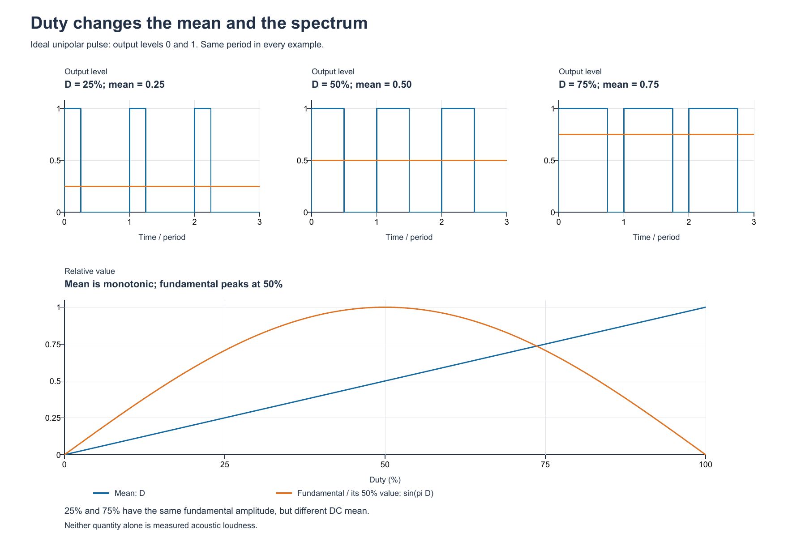
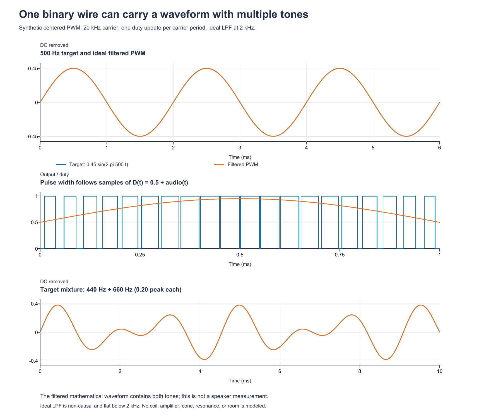
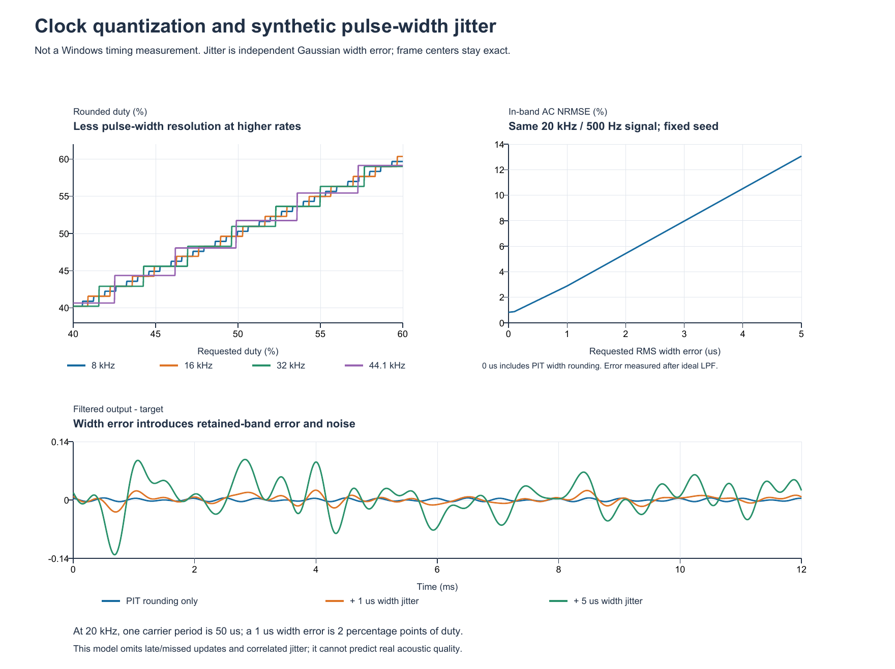

# ШИМ и PC speaker: как получить ровный звук

## Короткий ответ

Широтно-импульсная модуляция может передавать звуковую волну через один
двухуровневый выход. При подходящем излучателе и фильтрации в ней могут быть
сразу несколько нот. Для этого нужны короткие импульсы с меняющейся шириной,
запускаемые через одинаковые промежутки времени.

В Speaker Studio сейчас PIT сам удерживает прямоугольный тон. Это хороший
способ играть мелодию по нотам. Для PWM-аудио потребуется другой выходной
механизм: текущая DLL даёт доступ к портам, но не проигрывает очередь отсчётов.

**Практический вывод:** сначала нужно проверить временной механизм и сигнал
на контактах. Ползунок заполнения сам по себе качественную громкость не создаёт.
Ниже — объяснение, расчётный опыт и конкретный план следующего этапа.

## 1. Три числа, из которых состоит ШИМ

Выход переключается между низким и высоким уровнями. Напряжение высокого
уровня задаётся схемой платы. Программа меняет время его присутствия.

| Величина | Значение | Пример |
| --- | --- | --- |
| Период `T` | Время одного полного цикла | 50 мкс |
| Ширина `t_on` | Сколько времени выход находится на высоком уровне | 12,5 мкс |
| Заполнение `D = t_on / T` | Доля высокого уровня в цикле | 25% |

Частота несущей `f_c = 1 / T`: при периоде 50 мкс получается 20 000 циклов
в секунду. **Несущая** — быстрый ритм импульсов, на котором передаётся звук.

Термин «скважность» иногда используют как синоним заполнения. В строгой
русской терминологии это обратная величина: `Q = T / t_on = 1 / D`.
При заполнении 25% скважность равна 4; при 50% — 2.

## 2. Почему заполнение и громкость — разные вещи

Для идеального выхода с уровнями `0` и `V` среднее напряжение равно `V × D`.
У условного выхода 5 В заполнения 25%, 50% и 75% дают средние 1,25 В,
2,5 В и 3,75 В. Это пример расчёта; напряжение нашей платы не измерено.

Speaker реагирует на изменения сигнала. Постоянная составляющая и переменная
составляющая действуют по-разному. Если менять заполнение прямоугольного тона
на одной звуковой частоте, амплитуда его первой гармоники описывается так:

```text
A1 = (2 × V / π) × sin(π × D)
```

При 50% она максимальна. При 25% и 75% она одинакова, хотя средние напряжения
разные. Меняется и набор гармоник — дополнительных частот, определяющих тембр.
Поэтому «больше процентов» не означает «пропорционально громче».
Разложение PWM на среднее и гармоники разобрано в [материале TI о PWM DAC](https://www.ti.com/lit/an/spraa88a/spraa88a.pdf).



Верхние линии — импульсы при заполнении 25/50/75%. На нижнем графике растущее
среднее напряжение сравнивается с амплитудой первой гармоники. Среднее
нормировано на высокий уровень, гармоника — на свой максимум при 50%.
График описывает идеальные импульсы.

## 3. Как из быстрых импульсов получается мелодия

Для PWM-аудио период несущей удерживают постоянным, а заполнение меняют
в соответствии с отсчётами нужной звуковой волны:

```text
x[n] — звуковой отсчёт в диапазоне от −1 до +1
D[n] = 0,5 + 0,45 × x[n]
```

Заполнение в этом примере меняется от 5% до 95%. Фильтр низких частот
подавляет быструю несущую и оставляет более медленные изменения среднего.
Для синусоиды 440 Гц заполнение проходит свою плавную волну 440 раз в секунду,
хотя сами импульсы повторяются гораздо чаще.

Постоянные 50% содержат средний уровень и несущую; синусоиды 440 Гц в них нет.
Амплитуда восстановленного сигнала задаётся **глубиной изменения вокруг 50%**:
уменьшение коэффициента 0,45 до 0,225 уменьшает амплитуду желаемой волны вдвое.
Реальная слышимая громкость дополнительно зависит от излучателя и его монтажа.

В электронной схеме фильтром могут быть отдельные компоненты. У speaker есть
собственная электрическая и механическая характеристика, но считать её
идеальным фильтром нельзя. Остаток несущей, боковые частоты и резонансы могут
быть слышны. Даже 20 кГц нельзя автоматически считать неслышимыми для всех.
[TI отдельно различает частоту PWM, частоту отсчётов и полосу сигнала](https://www.ti.com/lit/an/slaa497/slaa497.pdf).

### Один выход способен нести несколько частот

Сначала складываются сами волны, затем сумма кодируется заполнением:

```text
D[n] = 0,5 + 0,2 × sin(2π × 440 × n / f_s) + 0,2 × sin(2π × 660 × n / f_s)
```

В расчётном опыте после фильтра две самые сильные составляющие действительно
оказались на 440 и 660 Гц. Это помогает уточнить прежнее ограничение проекта:
режим PIT с одним делителем задаёт один тон, а быстрый поток PWM может описывать
сложную волну. Разность частот двух нот исходную смесь не заменяет.



Верхняя панель сравнивает желаемую синусоиду 500 Гц с восстановленной волной.
В середине показаны бинарные импульсы и меняющееся заполнение; внизу —
восстановление смеси 440/660 Гц. Периоды точно равны 50 мкс, идеальный фильтр
оставляет частоты до 2 кГц. Реальная схема платы и speaker не моделируются.

## 4. Что требуется для ровной модуляции

У правильной PWM нет одной универсальной настройки «качество». Есть несколько
условий, которые нужно выполнять одновременно:

1. **Ровный период.** Следующий цикл начинается в запланированный момент.
2. **Точная ширина.** Длительность импульса соответствует нужному заполнению.
3. **Достаточная частота отсчётов.** Для полосы звука `B` необходимо `f_s > 2B`;
   практически нужен запас для фильтрации. Дробление CSV на строки этого не даёт.
4. **Подавление несущей.** Фильтр пропускает нужный звук и ослабляет импульсный
   ритм с его гармониками. Слишком узкий фильтр сгладит и полезные детали.
5. **Отсутствие перегрузки.** Сумма голосов укладывается в допустимое заполнение.
6. **Непрерывность волны.** Фаза не обнуляется на каждом обновлении; начало и
   конец звука сглаживаются короткой огибающей, чтобы уменьшить щелчки.

Частота отсчётов `f_s` и частота несущей `f_c` в общем случае различаются.
В простом варианте «один импульс на отсчёт» они совпадают. У аппаратного PWM
один отсчёт может сохранять заполнение на протяжении нескольких циклов.

## 5. Что позволяет PIT материнской платы

Сейчас `SpeakerOutput` записывает `0xB6`: channel 2, mode 3. Делитель задаёт
частоту. При чётном делителе высокий и низкий участки равны; при нечётном
отличаются на один такт. Независимого регистра заполнения в этом режиме нет.

Mode 1 работает как запускаемый импульс: таймер аппаратно отсчитывает его
длительность. Но следующий импульс нужно запустить отдельно. **Точная ширина
одного импульса ещё не обеспечивает ровного потока импульсов.** Формы сигнала,
режимы и условия запуска показаны в [оригинальном datasheet Intel 8254](https://www.cs.cmu.edu/~410/doc/8254.pdf).

Нулевой binary count означает 65 536 тактов, а не нулевую ширину импульса.
Крайние заполнения и остановку необходимо обрабатывать отдельно.

При используемом в проекте такте `1 193 182 Гц` один шаг ширины составляет
около **0,838 мкс**. Чем чаще обновляется поток, тем меньше таких шагов помещается
в один кадр:

| Частота кадров | Период | Тактов PIT на кадр, примерно | Шаг заполнения |
| ---: | ---: | ---: | ---: |
| 8 кГц | 125 мкс | 149 | 0,67 процентного пункта |
| 16 кГц | 62,5 мкс | 75 | 1,34 процентного пункта |
| 32 кГц | 31,25 мкс | 37 | 2,68 процентного пункта |
| 44,1 кГц | 22,68 мкс | 27 | 3,70 процентного пункта |

Это расчёт верхней границы возможностей сетки ширины. Время обращений к портам
и запас между импульсами здесь не учтены. Дробное число тактов также не создаёт
само собой аппаратный период ровно 44,1 кГц. Формат PCM 16 бит не превращает
эту сетку в 16-битный преобразователь.

Есть работающий пример передачи PCM через этот путь: Linux
[snd-pcsp](https://github.com/torvalds/linux/blob/master/sound/drivers/pcsp/pcsp_lib.c)
использует mode 1 и kernel hrtimer. В его [настройках](https://github.com/torvalds/linux/blob/master/sound/drivers/pcsp/pcsp.h)
обычный период соответствует примерно 18,643 кГц и 64 тактам PIT.
Это подтверждает принцип, но не является готовым Windows решением.

Отдельно необходимо знать тип пищалки. Пассивный излучатель отвечает на внешнюю
волну; активный buzzer с внутренним генератором обычно воспроизводит собственный
тон. PWM питания обычно управляет включением собственного тона; восстановление
произвольной звуковой волны этим способом предполагать нельзя. Различие описывает
[производитель PUI Audio](https://puiaudio.com/resource/audio-buzzers-expansion/).

## 6. Почему Windows и InpOut — отдельная часть задачи

У текущего InpOut каждая запись `Out32` проходит через синхронный
`DeviceIoControl`. DLL не получает массив звуковых отсчётов для последующего
автоматического проигрывания. Механизм виден в исходниках из
[официального пакета InpOut](https://www.highrez.co.uk/Downloads/InpOut32/).

Для нынешних нот это удобно: PIT продолжает генерировать тон, пока Windows
занимается другими делами. При PWM с одним импульсом на отсчёт программа должна
успевать выдавать новое значение и запуск каждые десятки микросекунд.

`Stopwatch` точно измеряет время; он не заставляет поток исполняться вовремя.
После `Sleep` поток лишь становится готовым к выполнению и может ждать дальше.
Это различие объясняют [документация QPC](https://learn.microsoft.com/en-us/windows/win32/sysinfo/acquiring-high-resolution-time-stamps)
и [документация Sleep](https://learn.microsoft.com/en-us/windows/win32/api/synchapi/nf-synchapi-sleep).

High-resolution waitable timer и MMCSS могут улучшать поведение ожиданий и
приоритет мультимедийного потока. Они не обещают регулярные записи в порт каждые
50 мкс. Единицы времени API — например, 100 нс — также не являются гарантией
точности срабатывания. Источники: [CreateWaitableTimerEx](https://learn.microsoft.com/en-us/windows/win32/api/synchapi/nf-synchapi-createwaitabletimerexw),
[SetWaitableTimerEx](https://learn.microsoft.com/en-us/windows/win32/api/synchapi/nf-synchapi-setwaitabletimerex),
[MMCSS](https://learn.microsoft.com/en-us/windows/win32/procthread/multimedia-class-scheduler-service).

### Что показал программный опыт

Проверен короткий producer без DLL, портов и звука: он отмечал моменты выдачи
условных отсчётов. Период — 50 мкс, продолжительность — одна секунда, приоритет
потока обычный. Пропущенные слоты отбрасывались, чтобы не выдавать их пачкой.

| Способ ожидания | Выдано слотов из 19 999 | Пропущено | Максимальное опоздание |
| --- | ---: | ---: | ---: |
| Активное ожидание по Stopwatch | 19 998 | 1 | 54,4 мкс |
| Thread.Sleep(1) | 64 | 19 935 | 16 734,2 мкс |

Активное ожидание заметно точнее, но занимает вычислительные ресурсы и даже
в таком коротком опыте пропустило слот. Обращения InpOut здесь отсутствовали.
Это наблюдение на одном ПК; оно не даёт предела задержек под другой нагрузкой
и не подтверждает сигнал на контактах.

Перенос цикла в новый драйвер тоже требует собственного исследования.
Прерывания других устройств могут задерживать выполнение. Ограничение DPC
«до 100 мкс» описывает допустимую длительность процедуры, а не гарантированную
частоту её вызовов. См. [Timer accuracy](https://learn.microsoft.com/en-us/windows-hardware/drivers/kernel/timer-accuracy)
и [DPC guidelines](https://learn.microsoft.com/en-us/windows-hardware/drivers/kernel/guidelines-for-writing-dpc-routines).

## 7. Насколько мешают округление и ошибки времени

В расчётном опыте использованы синусоида 500 Гц, несущая 20 кГц,
заполнение `0,5 + 0,45 × sin(...)` и идеальный фильтр до 2 кГц.
Длительность — 100 мс, всего 2000 кадров. Импульсы расположены по центрам точных кадров; их спектр вычисляется из
интеграла каждого импульса, без грубой временной сетки рисунка.

Ошибка сравнивается с исходной волной после удаления постоянной составляющей
из обоих сигналов. **NRMSE** — среднеквадратическая ошибка, делённая на RMS
исходного звука. Меньшее значение означает более близкую волну в этой модели;
это не процент субъективного качества.

| Условие | NRMSE |
| --- | ---: |
| Точные ширины, конечная несущая 20 кГц | 0,1731% |
| Ширины округлены до шагов PIT | 0,8241% |
| Дополнительно заданная RMS ошибки ширины 0,1 мкс | 0,8773% |
| Дополнительно заданная RMS ошибки ширины 1 мкс | 2,8856% |
| Дополнительно заданная RMS ошибки ширины 5 мкс | 13,0624% |

Последние три сценария — независимые Gaussian ошибки ширины, а не измеренный
jitter Windows. Центры кадров в модели не сдвигаются. При 5 мкс уже 199 из
2000 импульсов пришлось ограничить допустимым диапазоном ширины; фактическая
RMS после этого равна 4,692 мкс. Опоздания,
пропуски целых кадров и задержки реальных I/O могут действовать иначе.



Слева — сетка округления ширины; справа — рост NRMSE при заданных ошибках.
Внизу показан остаток «восстановленная волна минус исходная».

Ожидание «идеальный фильтр даст ошибку меньше 0,1%» не подтвердилось:
конечная частота несущей оставляет небольшие искажения даже с точными ширинами.
Для смеси 440/660 Гц ошибка составила 0,1814%. Идеальный фильтр здесь
математический и использует прошлые и будущие значения; он не описывает реальную передаточную функцию
speaker. Рассчитанные числа нельзя выдавать за характеристики устройства.

## 8. Предлагаемая реализация

Для нашего проекта разумно разделить подготовку волны и способ её доставки:

```text
MIDI / CSV → синтез волны → ограничение полосы и амплитуды → отсчёты
           → расчёт ширин → отдельный PWM выход → speaker
```

Синтезатор хранит непрерывную фазу `φ[n+1] = φ[n] + 2π × f[n] / f_s`.
Огибающая управляет амплитудой начала и конца ноты. Плавная смена частоты
применяется к этой фазе. Временные границы переводятся в номера отсчётов
целиком, чтобы округление отдельных нот не растягивало песню.

Громкость становится коэффициентом звуковой волны перед переводом в заполнение,
а выход заранее вычисляет последовательность допустимых ширин. Во время
выдачи импульсов не должны выполняться расчёты модели, обновления графика,
записи логов или выделение памяти на каждый отсчёт.

Для воспроизведения тембра исходного MP3 нужен путь **MP3 → PCM → PWM**.
Промежуточный MIDI хранит ноты и теряет форму исходного звука; последующая
модуляция не восстановит потерянную информацию.

Следующий аппаратный эксперимент должен проверить:

- Тип излучателя, схему подключения и доступность нужного режима PIT.
- Реальный период и ширины импульсов на контактах при разных заполнениях.
- Задержки I/O, p99 и максимальное опоздание, пропуски под обычной нагрузкой.
- Спектр тестового тона, остаток несущей и шум при уменьшении амплитуды.
- Корректную остановку и восстановление исходного управления после ошибки.

Для периода 50 мкс особенно важны редкие опоздания на целый период:
маленькое среднее время не исключает слышимых выпадений. Осциллограф или
логический анализатор проверяет импульсы; микрофон проверяет акустический результат.

Если выдача каждого кадра через InpOut не выдерживает этот режим, понадобится
выход с независимым временным механизмом и буфером. Другая DLL или более
высокий приоритет потока сами такой механизм не создают.

**Итог:** ШИМ для сложной звуковой волны физически осмысленна. В текущем
проекте главный следующий вопрос — доставка ровных микросекундных кадров
и характеристика реального speaker. Это необходимо подтвердить прежде,
чем называть PWM режимом качественного воспроизведения.
