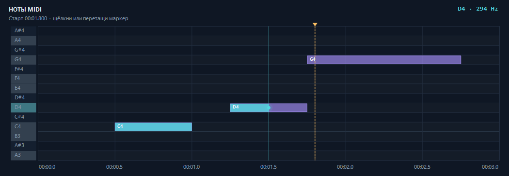

# Проверки и границы результатов

Дата подготовки публикации: 2026-10-02. Сборка исходников и тесты ниже выполнены
на текущем Windows host. Отдельная чистая Windows 10/11 VM не запускалась.

## Повторяемые проверки исходников

Из корня clone:

```powershell
.\speaker-player\build.ps1
.\speaker-player\test.ps1
.\speaker-player\test.ps1 -Platform x86
.\speaker-player\test.ps1 -IncludeVisualUi
```

Тесты генерируют MIDI и CSV самостоятельно. Четыре основных программы не требуют
Python, Node, модели, InpOut или музыкальных файлов. Дополнительный UI test
использует offscreen WinForms и требует интерактивного Windows desktop.
Результаты записываются в `speaker-player/build/tests/<platform>/test-results.json`.

Последние выполненные проверки подготовленного source tree:

| Проверка | x64 | x86 | Область проверки |
| --- | --- | --- | --- |
| Приложение: 18 C# source files | PASS, AnyCPU build | тот же EXE | Компиляция UI и core |
| TimingChecks | 3675 PASS | 3676 PASS | Масштабирование времени, grid, glide, паузы, Visual playback |
| SequenceDataChecks | 90 PASS | 90 PASS | CSV validation, delimiter, MIDI tempo/notes, generated fixtures |
| PlaybackTests | 142 PASS | 143 PASS | Seek, pause, loop, callbacks, cumulative deadlines |
| ProcessTests | 23 PASS | 23 PASS | Quoting, retry, отмена принадлежащего converter process tree |
| TimelineVisualChecks | 35 PASS | не запускалась | MIDI piano roll, rests, labels, selection, DPI |

Timed progress меняется с scheduling: число наблюдаемых callbacks и assertions
может немного отличаться между запусками. Это не заранее заданный критерий успеха.
В последнем ProcessTests завершение дерева процессов заняло 433 мс (x64) и
339 мс (x86). Это отдельные наблюдения на host, не обещание worst-case latency.



Изображение получено UI test; оно проверяет визуальное представление нот,
а не звучание или качество распознавания.

Pure Python MIDI exporter: 6 tests PASS при подготовке публикации;
использован существующий CPython 3.12 runtime с Mido. Дополнительные checks доступны в
[tests/README.md](../speaker-player/tests/README.md). Они используют Mido,
не загружают модель и не распознают музыку.

## Проверки исходного локального portable комплекта

До публикации исходников отдельно проверялся локальный комплект приложения 2.0
с Python, Torch CPU, FFmpeg, Essentia и MuScriptor Small. Этот комплект не входит
в Git и результаты не означают, что dependencies автоматически появятся после clone.

- Вызов production EXE assembly → bundled конвертер → MIDI: 2 секунды audio,
  9 notes, 1 party; model load 8.99 с, inference 5.99 с, полный процесс 16.81 с.
- На записи 19.475 с: 203 notes, 3 parties, 4 chunks; на варианте с начальной
  тишиной 22.475 с: 191 notes, 2 parties, 5 chunks. Полный inference занимал
  около двух минут на CPU. Различие результатов не скрывается.
- Независимое чтение MIDI через Mido: 1200 checks; C# bridge — 19 checks,
  pure Python export — 6 checks. Эти результаты относятся к исходному набору
  экспериментов и не заменяют source-only тесты в таблице выше.
- Неверное audio и попытка перезаписать input: ошибка без созданного output.
- Запуск из другого directory с ложными PYTHONHOME/PYTHONPATH и PATH только
  System32; проверены app-local VC14 module paths и Microsoft signatures.
- Hash/size проверка 5117 файлов локального комплекта после smoke:
  исходный комплект не изменился, новый cache внутри него не появился.
- Ранее проверены search/filter/remove/restart, компактная и большая раскладка,
  hover tips, UAC arguments, marker/seek и stale callbacks; screenshots просмотрены.

Личные записи и приватные журналы этих запусков не опубликованы. Поэтому эти
наблюдения представлены как история локальных экспериментов, а не общедоступный
benchmark с воспроизводимым музыкальным корпусом. Для новой количественной оценки
нужны открытые audio fixtures и ручная разметка.

## Что не подтверждено

- Загрузка InpOut driver и управление портами на текущем проверочном host.
- Звучание физического speaker, акустическая точность glide и timing коротких нот.
- Работа на любой материнской плате или в любой конфигурации Windows 10/11.
- Точность автоматического выделения главной мелодии и идентичность output веб-сайту.
- Управление громкостью напряжением, исходный тембр и PCM playback.
- Полностью воспроизводимая новая установка всех MP3 dependencies с нуля.

Visual playback проверяет последовательность событий и UI. Оно не включает
аппаратный backend и не является доказательством звука.

## Следующий эксперимент

На свободном ПК с подтверждённым Speaker-разъёмом и известным InpOut:

1. Сравнить одинаковую искусственную последовательность с glide 0 и 80 мс,
   resolution 10 мс, gap 0.
2. Записать наблюдаемое звучание и, если доступно измерение, частоту/задержку
   переключений; отдельно отмечать результат чтения регистра.
3. Повторить с resolution 5/20/50 мс при одинаковом треке.
4. Для melody extraction использовать отдельный открытый набор с ручным MIDI
   ground truth и фиксированными правилами monophonic projection.

Шаблон: [EXPERIMENT_TEMPLATE.md](EXPERIMENT_TEMPLATE.md).
